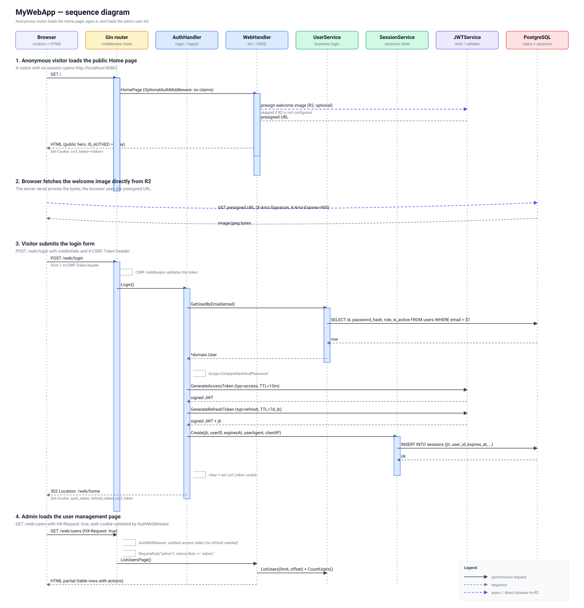
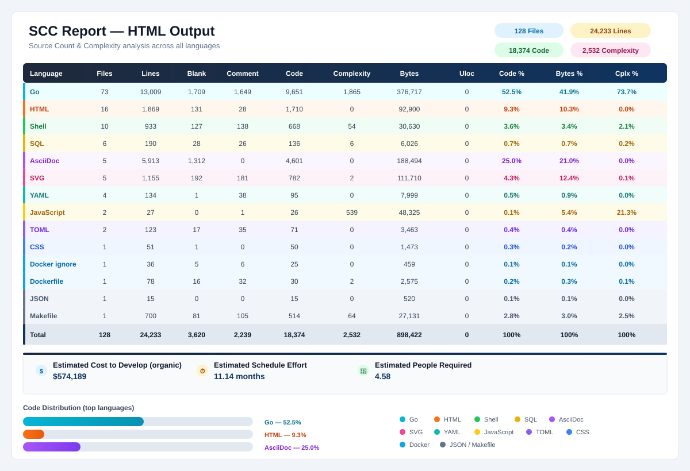

:doctype: article
:toc: left
:toc-title: Contents
:icons: font
:source-highlighter: coderay
:author_name: patrick toca
:author_email: link:mailto:[pmjtoca@gmail.com]
:stylesheet: ../asciidoctor.css
:pdf-theme: ../uked-theme.yml
:relfileprefix: ./
ifdef::env-github,env-browser[:outfilesuffix: .adoc]
:sectnums:
:sectnumlevels: 3
:description: MyWebApp is a modern Go web application template combining Gin, HTMX, Tailwind CSS, PostgreSQL, SQLC, and a clean architecture. It ships with structured logging (slog), per-request correlation IDs, gzip compression, token-bucket rate limiting, defence-in-depth HTTP security headers, secure cookies, CSRF protection with HMAC-signed tokens, a two-token JWT scheme with short-lived access tokens and revocable refresh tokens, a public home page and a read-only member directory, build-time version metadata exposed at /version, an isolated test database environment, Docker and Docker Compose deployment, Fly.io deployment with SOPS-encrypted secrets, and a fully working users CRUD UI rendered with HTMX.
:keywords: go, gin, htmx, tailwind, postgresql, sqlc, slog, jwt, rate limiting, gzip, clean architecture, csp, hsts, csrf, cookies, samesite, refresh-token, sessions, versioning, home-page, members, git-flow, testing, test-database, docker, compose, fly, sops, age, secrets

= MyWebApp template

{author_name}
v0.8.3, October 7th, 2026

'''

Creation Date: September 6th, 2026

Author: {author_name}

Email: {author_email}

<<<

== Overview

MyWebApp is a modern web application built with Go, using a clean
architecture with PostgreSQL as the database. It combines a
server-rendered HTMX frontend with a JSON API, sharing the same service
layer.

The project leverages powerful tools like Gin for HTTP routing, SQLC for
type-safe database queries, and `log/slog` for structured logging.

The application ships with a **public home page** reachable without
authentication, a **read-only member directory** available to any
authenticated user, and an **admin-only user-management surface** for
creating and modifying accounts. The binary reports its own build
metadata (version, commit, branch, build date) at runtime. A separate
**test database environment** runs every DB-dependent test against an
isolated PostgreSQL instance. A **Docker/Compose setup** runs the
container locally against a host PostgreSQL, and a **Fly.io deployment**
runs the same image in production with SOPS-encrypted secrets.

[[fig-sequence]]
.Login and admin-list sequence

=== Technology Stack

* **Go 1.21+** — Primary programming language
* **Gin** — HTTP web framework (with custom middleware for gzip, rate limiting, structured logging, security headers, and CSRF)
* **HTMX** — Hypermedia-driven frontend (no build step for interactivity)
* **Tailwind CSS** — Utility-first CSS framework
* **PostgreSQL** — Database
* **pgx/v5** — PostgreSQL driver and connection pool
* **SQLC** — Type-safe SQL code generation
* **log/slog** — Structured logging (JSON or text)
* **JWT** (`golang-jwt/jwt/v5`) — Access and refresh tokens with server-side revocation
* **bcrypt** (`golang.org/x/crypto`) — Password hashing
* **SOPS + age** — Encrypted secrets file, decrypted at boot by `internal/credentials`
* **Cloudflare R2** (optional) — Private welcome image via presigned URLs
* **Docker / Docker Compose** — Local containerised runs
* **Fly.io** — Production deployment with Fly Secrets
* **Air** — Live reload for development

<<<

=== Architecture

The application follows a clean architecture pattern:

* **Domain Layer** (`internal/domain/`) — Core business models, DTOs, and domain errors
* **Service Layer** (`internal/service/`) — Business logic, transaction orchestration, session management
* **Repository Layer** (`internal/repository/`) — Data access (SQLC-generated)
* **Handler Layer** (`internal/handler/`) — JSON API handlers
* **Web Layer** (`internal/web/`) — HTMX/HTML handlers, auth flows, cookie helpers, template helpers
* **Middleware Layer** (`internal/middleware/`) — Request ID, access log, gzip, rate limiting, security headers, CSRF, role check
* **Logging Layer** (`internal/logging/`) — Process-wide `slog` configuration
* **Auth Layer** (`internal/auth/`) — JWT issuance/validation, password hashing
* **Credentials Layer** (`internal/credentials/`) — Loads SOPS-encrypted secrets into the environment at boot
* **Version Layer** (`internal/version/`) — Build-time metadata injected by the linker
* **Testutil Layer** (`internal/testutil/`) — Isolated test database harness
* **Database Layer** (`pkg/db/`) — Pool configuration, transactions, `.env` loading
* **Object Storage** (`pkg/r2/`) — Cloudflare R2 client for presigned URLs

=== What's New in v0.8.3

* **Docker and Docker Compose verified end-to-end** — the image builds
  locally, connects to PostgreSQL, publishes port 8080, and `/health`
  returns `{"status":"ok"}`.
* **`compose.yaml` hardened** — prevents registry pulls, uses the working
  bridge network, preserves `host.docker.internal`, and uses a
  GET-compatible healthcheck.
* **`.env.docker.local`** now sets `PORT=8080`, and is gitignored
  alongside the other Docker env files.
* **SOPS + age secret loading** — `internal/credentials` decrypts
  `secrets.enc.yaml` at boot using `AGE_KEY`, and exports each known
  secret into the process environment. See
  link:docs/age_sops_fly_howto.adoc[the age/SOPS/Fly how-to].
* **Dockerfile, `fly.toml`, and logging updated** for the container
  workflow.
* **New doc:**
  link:docs/webapp_in_prod_with_docker_and_fly.adoc[Running in Production with Docker and Fly.io].

=== What's New in v0.8.1

* **CSRF token signing** — the CSRF cookie now carries an HMAC
  signature over the token body. The middleware rejects any cookie
  whose signature does not verify, closing the cookie-tossing path in
  which an attacker plants a valid-looking cookie.
* **Bearer exemption tightened** — `CSRFMiddleware` skips validation
  only when `AuthMiddleware` has explicitly marked the request as
  Bearer-authenticated.
* **API paths accept only Bearer tokens** — cookie authentication is
  refused on `/api/*`.
* **Bearer token endpoint** — `POST /api/v1/auth/token` exchanges
  credentials for a Bearer access token.
* **Silent refresh reloads the user** — the middleware reads the
  current role and `is_active` flag from the database on every refresh.
* **Logout revokes the correct session** — `Logout` parses the refresh
  cookie to obtain the `jti` before revoking.
* **Rate limiter hardening** — keying uses Gin's `ClientIP()`; IPv6 is
  keyed by `/64`; the per-limiter map is capped with a fallback bucket;
  `Retry-After` reflects the actual rate; a `Stop` method prevents the
  cleanup goroutine from leaking.

=== What's New in v0.8.0

* **Isolated test database environment** — `internal/testutil` provides
  a per-binary test harness that resets the schema, applies migrations
  in-process, and seeds the demo users.
* **Expanded test coverage** — source-only coverage rose from 20.5% to
  42.3%.
* **Bug fixes caught by the new tests** — `UserService.DeleteUser`
  returns `ErrUserNotFound` for a nonexistent user; gzip no longer
  advertises compression on 204 responses.

=== What's New in v0.7.1

* **Build-time version metadata** — `internal/version` carries the
  semantic version, git commit, branch, build date, and dirty flag,
  injected by `-ldflags -X`. A public `GET /version` endpoint reports
  the same information as JSON.
* **Release build tooling** — `scripts/build.sh` compiles with the
  correct `-ldflags` and `-trimpath` flags.
* **Stats endpoint available to all roles** — `/web/users/stats` moved
  out of the admin-only group.

=== What's New in v0.7.0

* **Public home page** — `/` and `/web/home` are served to anonymous
  visitors and authenticated users alike.
* **Read-only member directory** — `/web/members` lists registered
  users to every authenticated caller.
* **Unified post-login redirect** — every authenticated role lands on
  `/web/home` after login or registration.
* **Cache-Control hardening** — `abortUnauthenticated` emits
  `Cache-Control: no-store` on every 401 and login redirect.

=== What's New in v0.6.x

* **Role-based authorization** — `RequireRole` middleware, admin-only
  route groups, and dedicated role-change endpoints.
* **Self-service landing page** — `/web/me` for non-admin users.
* **Private R2 welcome image** — presigned URLs generated on demand.
* **Dedicated role-change forms** — separate DTO
  (`UpdateUserRoleRequest`) keeps `role` out of create/update payloads.

=== Earlier releases

* **v0.5.0** — HTTP security headers, secure cookies, CSRF protection,
  two-token JWT scheme with a `sessions` table, silent refresh.
* **v0.4.0** — HTTP security headers and secure cookie attributes.
* **v0.3.0** — Structured logging, request IDs, gzip, rate limiting,
  graceful shutdown, health endpoint.

<<<

== Prerequisites

=== Required Software

* Go 1.21 or higher
* PostgreSQL 14 or higher
* Node.js 18+ (for Tailwind CSS build)
* Make (optional but recommended)
* Git
* Docker and Docker Compose (optional, for containerised runs)
* `age` and `sops` (for encrypted secrets — see
  link:docs/age_sops_fly_howto.adoc[the age/SOPS/Fly how-to])
* `flyctl` (optional, for Fly.io deployment)

=== Install Development Tools

[source,bash]
----
# Install Air (live reload)
go install github.com/air-verse/air@latest

# Install SQLC (type-safe SQL)
go install github.com/sqlc-dev/sqlc/cmd/sqlc@latest

# Install golang-migrate (migrations), with the PostgreSQL driver compiled in
go install -tags 'postgres' github.com/golang-migrate/migrate/v4/cmd/migrate@latest
----

NOTE: The `-tags 'postgres'` flag is required. Without it, the `migrate`
binary has no database drivers and will fail with
`unknown driver postgres (forgotten import?)` on first use.

<<<

=== Environment Setup

Create a `.env` file in the project root:

[source,.env]
----
# Server
PORT=8080
GIN_MODE=release

# Database
DB_HOST=localhost
DB_PORT=5432
DB_USER=postgres
DB_PASSWORD=postgres
DB_NAME=mywebapp
DB_SSLMODE=disable

# Pool tuning (optional — sensible defaults apply)
DB_MAX_CONNS=25
DB_MIN_CONNS=5
DB_MAX_CONN_LIFETIME=1h
DB_MAX_CONN_IDLE_TIME=30m
DB_HEALTH_CHECK_PERIOD=1m
DB_CONNECT_TIMEOUT=5s
DB_STATEMENT_TIMEOUT=30s

# -----------------------------------------------------------------------------
# Test database
# -----------------------------------------------------------------------------
# Tests run against a separate database, never against DB_NAME above.
# TEST_DB_NAME must not equal DB_NAME. If it is empty or matches,
# every DB-dependent test skips with a clear message.
TEST_DB_HOST=localhost
TEST_DB_PORT=5432
TEST_DB_USER=postgres
TEST_DB_PASSWORD=postgres
TEST_DB_NAME=mywebapp_test
TEST_DB_SSLMODE=disable

# Pool tuning for the test database (smaller than production).
TEST_DB_MAX_CONNS=10
TEST_DB_MIN_CONNS=1
TEST_DB_CONNECT_TIMEOUT=5s
TEST_DB_STATEMENT_TIMEOUT=30s

# Auth — ALWAYS override in production (or load from secrets.enc.yaml)
JWT_SECRET=change-me-in-production-please

# JWT token TTLs
JWT_ACCESS_TTL=15m
JWT_REFRESH_TTL=168h

# Logging
LOG_FORMAT=json
LOG_LEVEL=info

# Security headers
CSP_REPORT_ONLY=true
CSP_REPORT_URI=
HSTS_MAX_AGE=0
HSTS_INCLUDE_SUBDOMAINS=false
HSTS_PRELOAD=false
X_FRAME_OPTIONS=DENY
REFERRER_POLICY=strict-origin-when-cross-origin
PERMISSIONS_POLICY=
COOP=same-origin
CORP=same-origin

# Secure cookies
COOKIE_SECURE=false
COOKIE_SAMESITE=lax
COOKIE_DOMAIN=

# CSRF
CSRF_FORM_FIELD=csrf_token
CSRF_HEADER_NAME=X-CSRF-Token
CSRF_TOKEN_LENGTH=32
CSRF_COOKIE_MAX_AGE=0
CSRF_SECRET=

# Cloudflare R2 (optional — leave all four empty to disable the welcome image)
R2_ACCOUNT_ID=
R2_ACCESS_KEY_ID=
R2_SECRET_ACCESS_KEY=
R2_BUCKET_NAME=
R2_IMAGE_KEY=welcome.jpg
----

WARNING: For local HTTP development, `COOKIE_SECURE=false` is mandatory.
If left at the `true` default while running over plain HTTP, the browser
accepts the cookie on login but silently refuses to send it back.

<<<

=== Secrets Management in Dev and in Prod

Secrets (`JWT_SECRET`, `CSRF_SECRET`, `DB_PASSWORD`,
`TEST_DB_PASSWORD`, R2 credentials) are stored in a SOPS-encrypted
`secrets.enc.yaml` and loaded at boot by `internal/credentials` using
the `AGE_KEY` environment variable. In development, `AGE_KEY` is unset
and the loader falls back to `~/.config/sops/age/keys.txt`; in
containers and on Fly.io, it is supplied as a secret.

See link:docs/age_sops_fly_howto.adoc[the age/SOPS/Fly how-to] for
installation, key generation, editing the encrypted file, rotation, and
troubleshooting.

<<<

== Initial Setup

=== 1. Clone the Repository

[source,bash]
----
git clone https://github.com/yourusername/mywebapp.git
cd mywebapp
----

=== 2. Install Dependencies

[source,bash]
----
make install
# or manually:
go mod download
go mod tidy
npm install
----

=== 3. Create the Database

[source,bash]
----
createdb mywebapp
# or:
psql -c "CREATE DATABASE mywebapp;"
----

=== 4. Run Migrations

[source,bash]
----
make migrate-up
----

This creates the `users` and `sessions` tables, along with their indexes
and the foreign key from `sessions.user_id` to `users.id`.

=== 5. Seed Demo Users

[source,bash]
----
make seed
----

This inserts five bcrypt-hashed demo users. The primary demo login is:

* **alice@example.com** / `password123` (admin)

=== 6. Generate SQLC Code

[source,bash]
----
make generate
----

=== 7. Build Tailwind CSS

[source,bash]
----
make build-css
----

=== 8. Run the Application

[source,bash]
----
# Run normally
make run

# Or with live reload (recommended for development)
make dev
----

=== Quick Start (All-in-One)

[source,bash]
----
make setup && make seed && make dev
----

<<<

== Running with Docker and Docker Compose

The container image is self-contained. The two most common runtime
failures are a missing `AGE_KEY` and a `DB_HOST` set to `localhost`.
Full details are in
link:docs/webapp_in_prod_with_docker_and_fly.adoc[Running in Production with Docker and Fly.io].

=== Supplying `AGE_KEY` at container start

[source,bash]
----
docker run --rm \
  -e AGE_KEY="$(grep -v '^#' ~/.config/sops/age/keys.txt)" \
  -e DB_HOST=host.docker.internal \
  -e DB_PORT=5432 \
  -e DB_USER=pmjtoca \
  -e DB_NAME=MyWebApp \
  -e DB_SSLMODE=disable \
  --add-host host.docker.internal:host-gateway \
  -p 8080:8080 \
  mywebapp:debug
----

=== Using an untracked env file (recommended)

Create `.env.docker.local` with the runtime values:

[source,.env.docker.local]
----
AGE_KEY=AGE-SECRET-KEY-...
DB_HOST=host.docker.internal
DB_PORT=5432
DB_USER=pmjtoca
DB_NAME=MyWebApp
DB_SSLMODE=disable
PORT=8080
----

Then:

[source,bash]
----
docker run --rm \
  --env-file .env.docker.local \
  --add-host host.docker.internal:host-gateway \
  -p 8080:8080 \
  mywebapp:debug
----

=== Docker Compose

The repository ships with a `compose.yaml` that:

* builds the image locally (no registry pull),
* uses a working bridge network,
* preserves `host.docker.internal:host-gateway`,
* uses a GET-compatible healthcheck,
* reads `.env.docker.local`.

[source,yaml]
----
services:
  app:
    build: .
    ports:
      - "8080:8080"
    env_file:
      - .env.docker.local
    extra_hosts:
      - "host.docker.internal:host-gateway"
----

Run:

[source,bash]
----
docker compose up --pull always
----

Verify:

[source,bash]
----
curl -s http://localhost:8080/health
# {"status":"ok", ...}
----

=== `DB_HOST` reference

[cols="1,2",options="header"]
|===
| Where PostgreSQL runs | Value for `DB_HOST`

| On the host machine
| `host.docker.internal`

| In Docker Compose
| The database service name, for example `db`

| On Fly.io
| The private or managed database hostname

| Anywhere else
| Its reachable DNS name or IP address
|===

<<<

== Running on Fly.io

[source,bash]
----
fly secrets set AGE_KEY="$(grep -v '^#' ~/.config/sops/age/keys.txt)"
fly deploy
----

`AGE_KEY` is the only Fly Secret that needs to be set. Everything else
lives in `secrets.enc.yaml`, which is decrypted at boot. Fly injects
the secret into the running machine at start time, so it never appears
in the image or in a repository.

<<<

== Testing

The project ships with an isolated test database environment. Tests
never touch the production database.

=== Running the tests

[source,bash]
----
make test                  # full suite, serialised (-p 1)
make test-coverage         # HTML report over every package
make test-coverage-src     # report excluding generated/wiring packages
----

=== How the test database works

`internal/testutil` is the harness. Its `Setup()` function, called from
each DB-dependent package's `TestMain`, does four things:

. Opens a pool to the database named by `TEST_DB_*`.
. Resets the schema (`DROP SCHEMA public CASCADE; CREATE SCHEMA public`).
. Runs the migrations in-process.
. Seeds the demo users.

=== Safety guards

* `TEST_DB_*` are separate variables from `DB_*`.
* `db.IsTestConfig` refuses to run if `TEST_DB_NAME` equals `DB_NAME`.
* If `TEST_DB_NAME` is empty or does not contain `test`, `ci`, `tmp`,
  or `scratch`, `LoadTestConfig` returns `(nil, false)` and every
  DB-dependent test skips.

=== Test coverage

Source-only coverage is approximately 58%. The per-package figures:

[cols="2,1",options="header"]
|===
| Package | Coverage

| `internal/auth` | ~78%
| `internal/handler` | ~62%
| `internal/middleware` | ~88%
| `internal/service` | ~60%
| `internal/version` | ~66%
| `internal/web` | ~70%
|===

<<<

== Configuration Reference

=== Logging

[cols="1,2,1"]
|===
| Variable | Values | Description
| `LOG_FORMAT` | `text` \| `json` | Output format.
| `LOG_LEVEL` | `debug` \| `info` \| `warn` \| `error` | Minimum level.
|===

Logs are written to `logs/app.log`. When running in an interactive
terminal, they are also mirrored to stderr.

=== Structured Log Fields

[source,json]
----
{
  "time": "2026-10-02T12:34:56.214266491+01:00",
  "level": "INFO",
  "msg": "http_request",
  "request_id": "a9346c63f1de4251ddf025d9043d453d",
  "method": "POST",
  "path": "/web/login",
  "status": 200,
  "latency": 2781319,
  "client_ip": "::1",
  "size": 2249
}
----

==== Request Correlation

Every request is assigned a `request_id`. The ID is returned as the
`X-Request-ID` response header, attached to the request-scoped
`*slog.Logger`, and included on every line emitted through
`middleware.LoggerFromGin(c)`.

[source,bash]
----
grep '"request_id":"a9346c63f1de4251ddf025d9043d453d"' logs/app.log
----

<<<

=== Rate Limiting

Three token-bucket limiters run by default:

[cols="2,1,1,1"]
|===
| Scope | Rate | Burst | TTL
| Global (all routes) | 20 req/s | 40 | 10 min
| Auth routes | 5 req/min | 5 | 15 min
| Refresh route (`/web/refresh`) | 1 req/s | 30 | 15 min
|===

Buckets are keyed by the client IP returned from Gin's `ClientIP()`,
which honours the trusted-proxy configuration set on the engine.

=== Gzip Compression

The gzip middleware only compresses when `Accept-Encoding: gzip` is
present, skips WebSocket/SSE upgrades, skips already-compressed types,
sets `Vary: Accept-Encoding`, and removes `Content-Length`.

=== HTTP Security Headers

The `SecurityHeaders` middleware sets defence-in-depth headers on every
response. Full rationale in
`docs/security_headers_cookies_csrf_jwtscheme.adoc`.

[cols="2,2"]
|===
| Header | Default

| `Content-Security-Policy(-Report-Only)` | tailored to HTMX + Tailwind; report-only in dev
| `Strict-Transport-Security` | disabled (`HSTS_MAX_AGE=0`)
| `X-Frame-Options` | `DENY`
| `X-Content-Type-Options` | `nosniff`
| `Referrer-Policy` | `strict-origin-when-cross-origin`
| `Permissions-Policy` | camera/mic/geo/etc. disabled
| `Cross-Origin-Opener-Policy` | `same-origin`
| `Cross-Origin-Resource-Policy` | `same-origin`
|===

=== Secure Cookies

[cols="1,1,2"]
|===
| Cookie | HttpOnly | Purpose

| `auth_token` | yes | Short-lived access token (`JWT_ACCESS_TTL`, default 15 min)
| `refresh_token` | yes | Long-lived refresh token (`JWT_REFRESH_TTL`, default 7 days)
| `csrf_token` | **no** | Readable by JavaScript; required for the double-submit pattern
|===

=== CSRF Protection

Every mutating request (`POST`, `PUT`, `PATCH`, `DELETE`) carries a CSRF
token that the server compares against the `csrf_token` cookie using a
constant-time comparison. The cookie value also carries an HMAC
signature; the middleware rejects any cookie whose signature does not
verify under `CSRF_SECRET`.

=== Authentication

The application uses a **two-token JWT scheme**:

* **Access token** — short-lived (15 min default), presented on every
  request. Stateless.
* **Refresh token** — long-lived (7 days default), carries a `jti`
  claim recorded in the `sessions` table.

Two transports: **Cookie** (`auth_token`, `refresh_token`) for browser
and HTMX requests; **Authorization: Bearer `<access-token>`** for API
clients. Bearer requests are exempt from CSRF and are not eligible for
silent refresh. Bearer tokens are issued by `POST /api/v1/auth/token`.

==== Silent Refresh

When a request arrives with an expired `auth_token` but a valid,
unrevoked `refresh_token`, the middleware reloads the user from the
database, mints a fresh access token, sets it as a new `auth_token`
cookie, and lets the request proceed.

==== Revocation

Logout, role changes, and account deactivation all revoke the
corresponding `sessions` row. A revoked refresh token cannot be
exchanged for an access token, so the session ends within the
access-token TTL.

=== Authorization

Three roles exist: `user`, `moderator`, and `admin`. Every route falls
into one of three categories:

[cols="1,2",options="header"]
|===
| Category | Routes

| Public — no authentication required
| `/`, `/web/home`, `/web/login`, `/web/register`, `/web/refresh`,
  `/api/v1/auth/token`, `/health`, `/version`, `/static/*`

| Authenticated — a valid session is required, any role
| `/web/members`, `/web/members/partial`, `/web/me`,
  `/web/users/stats`, `/web/logout`

| Admin-only — a valid session *and* `role=admin`
| `/web/users`, `/web/users/by-id`, `/web/users/new`,
  `/web/users/:id/edit`, `/web/users/:id/role`,
  `/api/v1/users/*`
|===

<<<

== Versioning

The binary reports its own build metadata through two channels: the
startup log line and the public `GET /version` endpoint.

[source,bash]
----
curl -s http://localhost:8080/version | jq .
----

[source,json]
----
{
  "version": "v0.8.3",
  "commit": "9d4e6e335a06",
  "branch": "develop",
  "state": "v0.8.3",
  "built": "2026-10-07T10:39:10Z",
  "go": "1.23.0",
  "modified": false
}
----

=== Release procedure

Releases follow Git Flow. Set the version prefix once:

[source,bash]
----
git config --global gitflow.prefix.versiontag v
----

Then, from `develop`:

[source,bash]
----
git flow release start 0.8.3
# update the version lines in the AsciiDoc documents, add a
# "What's New in v0.8.3" section, rebuild the PDFs, commit
git flow release finish 0.8.3
git push origin main
git push origin develop
git push origin v0.8.3
----

Do **not** run `git push --tags` — push the single release tag
explicitly so unrelated local tags are not published.

<<<

== Common Development Workflow

=== Daily Development

[source,bash]
----
make dev
----

=== Database Changes

==== 1. Create a Migration

[source,bash]
----
make migrate-create name=add_user_avatar
----

==== 2. Apply / Rollback

[source,bash]
----
make migrate-up      # apply
make migrate-down    # rollback one
make db-reset        # full reset (drop, up, seed)
----

==== Troubleshooting a Dirty Migration

[source,bash]
----
migrate -path migrations -database "$DB_URL" force 0
psql -d mywebapp -c "DROP SCHEMA public CASCADE; CREATE SCHEMA public;"
make migrate-up
make seed
----

=== Adding New Queries

[source,sql]
----
-- name: GetUserByEmailAndActive :one
SELECT id, email, username, full_name, is_active, role, last_login, created_at, updated_at
FROM users
WHERE email = $1 AND is_active = $2
LIMIT 1;
----

Then:

[source,bash]
----
make generate
----

=== Adding a New API Endpoint

[source,go]
----
func (h *PostHandler) CreatePost(c *gin.Context) {
    logger := middleware.LoggerFromGin(c)

    var req domain.CreatePostRequest
    if err := c.ShouldBindJSON(&req); err != nil {
        c.JSON(http.StatusBadRequest, gin.H{"error": err.Error()})
        return
    }

    post, err := h.service.CreatePost(c.Request.Context(), req)
    if err != nil {
        logger.Error("api: CreatePost failed", "error", err)
        c.JSON(http.StatusInternalServerError, gin.H{"error": "Something went wrong."})
        return
    }

    c.JSON(http.StatusCreated, domain.ToPostResponse(post))
}
----

=== Adding a New HTMX Page

[source,go]
----
func (h *WebHandler) ListPostsPage(c *gin.Context) {
    posts, _ := h.service.ListPosts(c.Request.Context(), 20, 0)

    data := gin.H{
        "posts":      posts,
        "csrf_token": middleware.TokenFromContext(c),
    }

    if IsHTMX(c) {
        c.HTML(http.StatusOK, "post_list.html", data)
        return
    }
    c.HTML(http.StatusOK, "base.html", gin.H{
        "title":        "Posts",
        "listEndpoint": "/web/posts",
        "csrf_token":   middleware.TokenFromContext(c),
    })
}
----

<<<

== Project Structure

[source,text]
----
mywebapp/
├── bin/                            # Compiled binaries (gitignored)
├── cmd/
│   └── api/
│       └── main.go                 # Entry point, middleware wiring
├── docs/
│   ├── images/
│   ├── age_sops_fly_howto.adoc
│   ├── security_headers_cookies_csrf_jwtscheme.adoc
│   └── webapp_in_prod_with_docker_and_fly.adoc
├── internal/
│   ├── auth/                       # JWT + bcrypt
│   ├── credentials/                # SOPS/age loader
│   ├── domain/                     # Models, DTOs, errors
│   ├── handler/                    # JSON API handlers
│   ├── logging/                    # slog setup
│   ├── middleware/                 # accesslog, csrf, gzip, ratelimit, requestid, require_role, security_headers
│   ├── repository/                 # SQLC-generated
│   ├── service/                    # business logic
│   ├── templates/                  # HTMX templates + partials
│   ├── testutil/                   # isolated test DB harness
│   ├── version/                    # build metadata
│   └── web/                        # HTMX handlers, cookies, auth
├── logs/
│   └── app.log                     # gitignored
├── migrations/
├── pkg/
│   ├── db/                         # pool config, tx helper
│   └── r2/                         # Cloudflare R2 presigned URLs
├── scripts/
│   ├── build.sh
│   └── seed.go
├── sqlc/
├── static/
├── .env                            # gitignored
├── .env.docker.local               # gitignored
├── .air.toml
├── .gitignore
├── compose.yaml                    # Docker Compose
├── Dockerfile
├── fly.toml
├── Makefile
├── go.mod
├── go.sum
├── package.json
├── tailwind.config.js
├── secrets.enc.yaml                # SOPS-encrypted secrets
└── README.adoc                     # This file
----

<<<

== Project inventory for v0.8.3

[[fig-scc-report]]
.Source code statistics for MyWebApp v0.8.3

<<<

== Available Make Commands

=== Application

[cols="1,3"]
|===
| Command | Description
| `make run` | Run the application in the foreground
| `make start` | Build and start in the background (writes `.pid`)
| `make stop` | Stop the background process
| `make restart` | Stop + start
| `make status` | Show whether the app is running
| `make logs` | Tail `logs/app.log`
| `make dev` | Live reload (Air) + Tailwind watch
| `make build` | Build Tailwind + production binary
| `make build-css` | Build Tailwind CSS only
| `make watch-css` | Tailwind in watch mode
| `make version` | Print the version metadata that `make build` will inject
| `make version-run` | Query `/version` on the running server
|===

=== Dependencies

[cols="1,3"]
|===
| Command | Description
| `make install` | Go + Node + dev tools
| `make generate` | Regenerate SQLC code
|===

=== Database

[cols="1,3"]
|===
| Command | Description
| `make migrate-up` | Apply migrations
| `make migrate-down` | Roll back one migration
| `make migrate-create name=<name>` | Create a new migration pair
| `make seed` | Seed demo users (bcrypt-hashed)
| `make db-reset` | stop → migrate-down → migrate-up → seed
| `make db-shell` | Open `psql`
| `make db-check` | Verify connection
| `make db-tables` | List tables
|===

=== Test database

[cols="1,3"]
|===
| Command | Description
| `make test-db-create` | Create the test database (idempotent)
| `make test-db-drop` | Drop the test database (with confirmation)
| `make test-db-reset` | Drop and recreate the test database
| `make test-db-check` | Print the resolved test configuration
| `make test-db-shell` | Open `psql` against the test database
|===

=== Testing & Quality

[cols="1,3"]
|===
| Command | Description
| `make test` | Run all tests (serialised; uses `TEST_DB_*`)
| `make test-fast` | Run non-DB packages in parallel
| `make test-coverage` | Raw HTML coverage over every package
| `make test-coverage-src` | Source-only coverage
| `make fmt` | `go fmt` + CSS rebuild
| `make lint` | `golangci-lint` (auto-installs if missing)
|===

=== Docker

[cols="1,3"]
|===
| Command | Description
| `make docker-up` | Start containers
| `make docker-down` | Stop containers
| `make docker-build` | Build images
| `make docker-logs` | Follow container logs
|===

=== Setup & Utilities

[cols="1,3"]
|===
| Command | Description
| `make setup` | install → generate → migrate-up → build-css
| `make dev-setup` | Same as `setup`, hints at `make dev`
| `make all` | clean → install → generate → migrate-up → build-css → build
| `make clean` | Remove binaries, `node_modules`, CSS output
| `make check-env` | Print loaded environment
| `make info` | Project metadata
| `make dirs` | Create standard directory layout
|===

<<<

== API Endpoints

=== Authentication API

[cols="1,2,1"]
|===
| Method | Endpoint | Description
| POST | `/api/v1/auth/token` | Exchange credentials for a Bearer access token
|===

=== Users API

[cols="1,2,1"]
|===
| Method | Endpoint | Description
| POST | `/api/v1/users` | Create a new user
| GET | `/api/v1/users` | List users (paginated)
| GET | `/api/v1/users/:id` | Get user by ID
| PUT | `/api/v1/users/:id` | Update user
| PUT | `/api/v1/users/:id/role` | Change a user's role
| DELETE | `/api/v1/users/:id` | Delete user
|===

All Users API routes require `Authorization: Bearer <access-token>` and
`role=admin`. Cookie authentication is refused on `/api/*`.

=== Web (HTMX) Routes

[cols="1,2,1"]
|===
| Method | Endpoint | Description
| GET | `/` | Public home page
| GET | `/web/home` | Public home page (explicit URL)
| GET | `/web/members` | Member directory (authenticated)
| GET | `/web/members/partial` | Member directory HTMX fragment
| GET | `/web/login` | Login page / form partial
| POST | `/web/login` | Submit login
| GET | `/web/register` | Register page / form partial
| POST | `/web/register` | Submit registration
| POST | `/web/refresh` | Exchange refresh token for a new access token
| POST | `/web/logout` | Revoke the session and clear all cookies
| GET | `/web/me` | Self-service account page
| GET | `/web/users` | Users list (admin)
| GET | `/web/users/by-id` | Users list by ID (admin)
| GET | `/web/users/new` | New user form (admin)
| POST | `/web/users` | Create user (admin)
| GET | `/web/users/:id/edit` | Edit user form (admin)
| PUT | `/web/users/:id` | Update user (admin)
| GET | `/web/users/:id/role` | Role-change form (admin)
| PUT | `/web/users/:id/role` | Submit role change (admin)
| DELETE | `/web/users/:id` | Delete user (admin)
| GET | `/web/users/stats` | Live member counts (any authenticated role)
|===

=== Operational Endpoints

[cols="1,2,1"]
|===
| Method | Endpoint | Description
| GET | `/health` | DB ping + pgx pool statistics
| GET | `/version` | Build metadata as JSON
| GET | `/test` | Template smoke test
| GET | `/static/*` | Static assets
|===

=== Example Requests

==== API token (JSON)

[source,http]
----
POST /api/v1/auth/token HTTP/1.1
Content-Type: application/json

{
    "email": "alice@example.com",
    "password": "password123"
}
----

Response:

[source,json]
----
{
    "access_token": "eyJhbGciOiJIUzI1NiIsInR5cCI6IkpXVCJ9...",
    "token_type": "Bearer",
    "expires_in": 900
}
----

==== Health Check

[source,http]
----
GET /health HTTP/1.1
----

[source,json]
----
{
    "status": "ok",
    "time": 1758567833,
    "pool": {
        "total": 5,
        "idle": 5,
        "acquired": 0,
        "max": 25,
        "constructing": 0,
        "acquire_count": 12,
        "empty_acquire": 0,
        "canceled_acquire": 0,
        "acquire_duration_ms": 3
    }
}
----

==== Version

[source,http]
----
GET /version HTTP/1.1
----

[source,json]
----
{
  "version": "v0.8.3",
  "commit": "9d4e6e335a06",
  "branch": "develop",
  "state": "v0.8.3",
  "built": "2026-10-07T10:39:10Z",
  "go": "1.23.0",
  "modified": false
}
----

<<<

== Troubleshooting

=== Common Issues

==== Database Connection Failed

[source,bash]
----
pg_isready
make check-env
make db-check
----

Inside a container, `localhost` refers to the container itself. Set
`DB_HOST=host.docker.internal` (with
`--add-host host.docker.internal:host-gateway` on Linux).

==== Missing `AGE_KEY`

The application fails fast when `AGE_KEY` is absent. Supply it at
runtime via `--env-file`, `-e`, or a Fly Secret. Never bake it into the
image or commit it. See
link:docs/webapp_in_prod_with_docker_and_fly.adoc[the Docker/Fly doc].

==== SQLC Generation Fails

[source,bash]
----
cd sqlc && sqlc generate
# or:
make generate
----

==== Migration Fails

[source,bash]
----
migrate -path migrations -database "$DB_URL" version
migrate -path migrations -database "$DB_URL" force <version>
----

For a development database:

[source,bash]
----
psql -d mywebapp -c "DROP SCHEMA public CASCADE; CREATE SCHEMA public;"
make migrate-up
make seed
----

==== `migrate: command not found`

[source,bash]
----
export PATH="$HOME/go/bin:$PATH"
echo 'export PATH="$HOME/go/bin:$PATH"' >> ~/.zshrc
----

==== `unknown driver postgres (forgotten import?)`

[source,bash]
----
go install -tags 'postgres' github.com/golang-migrate/migrate/v4/cmd/migrate@latest
----

==== `no migration found for version 0`

[source,bash]
----
psql -d mywebapp -c "DELETE FROM schema_migrations;"
make migrate-up
----

==== Air Not Found

[source,bash]
----
make install
----

==== Rate Limited During Development

Increase the global limiter in `cmd/api/main.go`:

[source,go]
----
globalLimiter := middleware.NewRateLimiter(60, 120, 10*time.Minute, 100_000)
----

==== Logged Out Immediately After Login

Set `COOKIE_SECURE=false` in `.env` for local dev.

==== Chrome Serves a Stale Redirect for `/`

Clear site data for `localhost` in DevTools → Application → Storage →
**Clear site data**.

==== CSRF 403 on a Form Submission

Reload the page and resubmit. In a cluster, set `CSRF_SECRET` to the
same value on every node.

==== DB-dependent tests skip

[source,bash]
----
make test-db-check
make test-db-create
----

==== `multiple definitions of TestMain`

[source,bash]
----
grep -rn 'func TestMain' internal/
----

Only one match per package is correct.

==== Logs Are JSON When I Want Text

[source,.env]
----
LOG_FORMAT=text
----

==== I Want Debug-Level Logs

[source,.env]
----
LOG_LEVEL=debug
----

=== Getting Help

* Tail the structured logs: `make logs`
* Grep one request: `grep '"request_id":"..."' logs/app.log`
* Check the health endpoint: `curl localhost:8080/health | jq`
* Check the running version: `curl localhost:8080/version | jq`
* Inspect active sessions:
+
[source,bash]
----
psql -d mywebapp -c "SELECT jti, user_id, issued_at, expires_at, revoked_at FROM sessions ORDER BY id DESC LIMIT 10;"
----
* Official docs:
** https://gin-gonic.com/
** https://htmx.org/
** https://sqlc.dev/
** https://github.com/golang-migrate/migrate
** https://github.com/air-verse/air
** https://pkg.go.dev/log/slog
** https://github.com/golang-jwt/jwt
** https://getsops.io/
** https://age-encryption.org/

<<<

== Contributing

. Fork the repository
. Create a feature branch
. Make your changes
. Run `make test` and `make lint`
. Submit a pull request

=== Conventions

* Use `middleware.LoggerFromGin(c)` (not `slog.Default()`) inside handlers.
* Return domain sentinel errors (`domain.ErrUserNotFound`, etc.) from
  services; map them in handlers.
* New SQL goes in `sqlc/queries.sql` or `sqlc/queries_sessions.sql`;
  never hand-edit `internal/repository/*.go`.
* New HTMX pages should expose a partial template and use a stable
  container id.
* Pass `csrf_token` into template data for any page rendering a
  mutating form.
* Mutating HTMX requests get `X-CSRF-Token` injected automatically.
* The root route `/` and `/web/home` are public. Any new protected
  route belongs behind `authMW`, and any admin-only route behind
  `RequireRole("admin")`.
* The public Home page uses `OptionalAuthMiddleware`. Do not swap in
  `authMW` on that route.
* New DB-dependent tests should call `testutil.NewPool(t)`, never
  `db.LoadConfig()` or `db.NewPool()`.
* Secrets belong in `secrets.enc.yaml`, never in `.env`, `fly.toml`,
  or a committed env file.

== License

This project is licensed under the MIT License — see the LICENSE file
for details.

== Contact

* Author: patrick toca
* Email: link:mailto:[pmjtoca@gmail.com]
* Issue Tracker: https://github.com/yourusername/mywebapp/issues
* Repository: https://github.com/yourusername/mywebapp