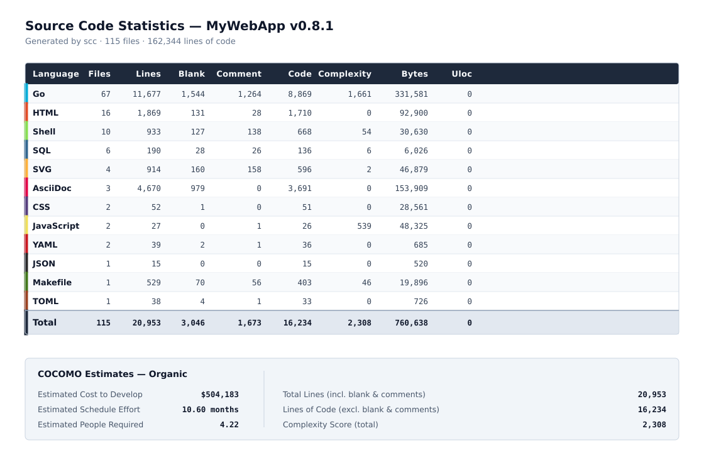

:doctype: article
:toc: left
:toc-title: Contents
:icons: font
:source-highlighter: coderay
:author_name: patrick toca
:author_email: link:mailto:[pmjtoca@gmail.com]
:stylesheet: ../asciidoctor.css
:pdf-theme: ../uked-theme.yml
:relfileprefix: ./
ifdef::env-github,env-browser[:outfilesuffix: .adoc]
:sectnums:
:sectnumlevels: 3
:description: MyWebApp is a modern Go web application template combining Gin, HTMX, Tailwind CSS, PostgreSQL, SQLC, and a clean architecture. It ships with structured logging (slog), per-request correlation IDs, gzip compression, token-bucket rate limiting, defence-in-depth HTTP security headers, secure cookies, CSRF protection with HMAC-signed tokens, a two-token JWT scheme with short-lived access tokens and revocable refresh tokens, a public home page and a read-only member directory, build-time version metadata exposed at /version, an isolated test database environment, and a fully working users CRUD UI rendered with HTMX.
:keywords: go, gin, htmx, tailwind, postgresql, sqlc, slog, jwt, rate limiting, gzip, clean architecture, csp, hsts, csrf, cookies, samesite, refresh-token, sessions, versioning, home-page, members, git-flow, testing, test-database

= MyWebApp template

{author_name}
v0.8.1, October 5th, 2026

'''

Creation Date: September 6th, 2026

Author: {author_name}

Email: {author_email}

<<<

== Overview

MyWebApp is a modern web application built with Go, using a clean
architecture with PostgreSQL as the database. It combines a
server-rendered HTMX frontend with a JSON API, sharing the same service
layer.

The project leverages powerful tools like Gin for HTTP routing, SQLC for
type-safe database queries, and `log/slog` for structured logging.

The application ships with a **public home page** reachable without
authentication, a **read-only member directory** available to any
authenticated user, and an **admin-only user-management surface** for
creating and modifying accounts. The binary reports its own build
metadata (version, commit, branch, build date) at runtime. A separate
**test database environment** runs every DB-dependent test against an
isolated PostgreSQL instance.

[[fig-sequence]]
.Login and admin-list sequence
image::docs/images/webapp_sequence_login.svg[Data-flow diagram,align="center",width=100%]

=== Technology Stack

* **Go 1.21+** — Primary programming language
* **Gin** — HTTP web framework (with custom middleware for gzip, rate limiting, structured logging, security headers, and CSRF)
* **HTMX** — Hypermedia-driven frontend (no build step for interactivity)
* **Tailwind CSS** — Utility-first CSS framework
* **PostgreSQL** — Database
* **pgx/v5** — PostgreSQL driver and connection pool
* **SQLC** — Type-safe SQL code generation
* **log/slog** — Structured logging (JSON or text)
* **JWT** (`golang-jwt/jwt/v5`) — Access and refresh tokens with server-side revocation
* **bcrypt** (`golang.org/x/crypto`) — Password hashing
* **Cloudflare R2** (optional) — Private welcome image via presigned URLs
* **Air** — Live reload for development

<<<

=== Architecture

The application follows a clean architecture pattern:

* **Domain Layer** (`internal/domain/`) — Core business models, DTOs, and domain errors
* **Service Layer** (`internal/service/`) — Business logic, transaction orchestration, session management
* **Repository Layer** (`internal/repository/`) — Data access (SQLC-generated)
* **Handler Layer** (`internal/handler/`) — JSON API handlers
* **Web Layer** (`internal/web/`) — HTMX/HTML handlers, auth flows, cookie helpers, template helpers
* **Middleware Layer** (`internal/middleware/`) — Request ID, access log, gzip, rate limiting, security headers, CSRF, role check
* **Logging Layer** (`internal/logging/`) — Process-wide `slog` configuration
* **Auth Layer** (`internal/auth/`) — JWT issuance/validation, password hashing
* **Version Layer** (`internal/version/`) — Build-time metadata injected by the linker
* **Testutil Layer** (`internal/testutil/`) — Isolated test database harness
* **Database Layer** (`pkg/db/`) — Pool configuration, transactions, `.env` loading
* **Object Storage** (`pkg/r2/`) — Cloudflare R2 client for presigned URLs

=== What's New in v0.8.1

* **CSRF token signing** — the CSRF cookie now carries an HMAC
  signature over the token body. The middleware rejects any cookie
  whose signature does not verify, closing the cookie-tossing path in
  which an attacker plants a valid-looking cookie.
* **Bearer exemption tightened** — `CSRFMiddleware` skips validation
  only when `AuthMiddleware` has explicitly marked the request as
  Bearer-authenticated. A request that merely carries an
  `Authorization` header is no longer exempt.
* **API paths accept only Bearer tokens** — cookie authentication is
  refused on `/api/*`. The API group has no CSRF middleware, so
  accepting cookies there would expose the JSON endpoints to CSRF.
* **Bearer token endpoint** — `POST /api/v1/auth/token` exchanges
  credentials for a Bearer access token, giving API clients a
  supported way to authenticate.
* **Silent refresh reloads the user** — the middleware now reads the
  current role and `is_active` flag from the database on every
  refresh, instead of trusting the stale claims in the refresh token.
* **Logout revokes the correct session** — `Logout` parses the refresh
  cookie to obtain the `jti` before revoking. The previous
  implementation called `Revoke` with an empty `jti`, which was a
  no-op.
* **Rate limiter hardening** — keying now uses Gin's `ClientIP()`, which
  honours the trusted-proxy configuration; IPv6 is keyed by `/64`; the
  per-limiter map is capped and falls back to a shared bucket when
  full; `Retry-After` reflects the limiter's actual rate; a `Stop`
  method prevents the cleanup goroutine from leaking.

=== What's New in v0.8.0

* **Isolated test database environment** — `internal/testutil`
  provides a per-binary test harness that resets the schema, applies
  migrations in-process, and seeds the demo users. Tests read
  `TEST_DB_*` environment variables and never touch the production
  database; `db.IsTestConfig` refuses to run if the two names
  coincide.
* **Expanded test coverage** — source-only coverage rose from 20.5%
  to 42.3%. The packages at or above the target are
  `internal/auth` (78%), `internal/handler` (62%),
  `internal/middleware` (88%), `internal/service` (60%), and
  `internal/version` (66%).
* **Bug fixes caught by the new tests** — `UserService.DeleteUser`
  now returns `ErrUserNotFound` for a nonexistent user instead of
  silently succeeding; the gzip middleware no longer advertises
  compression on 204 responses.

=== What's New in v0.7.1

* **Build-time version metadata** — `internal/version` carries the
  semantic version, git commit, branch, build date, and dirty flag,
  injected by `-ldflags -X` at build time. A new public
  `GET /version` endpoint reports the same information as JSON.
* **Release build tooling** — `scripts/build.sh` compiles with the
  correct `-ldflags` and `-trimpath` flags. The `make build` target
  uses the same flags and prints the metadata before compiling.
* **Documentation** — this README and
  `docs/security_headers_cookies_csrf_jwtscheme.adoc` updated for the
  v0.7.1 public home page, member directory, and version endpoint.
* **Stats endpoint available to all roles** — `/web/users/stats` moved
  out of the admin-only group so the Home page can display member
  counts to every authenticated user, not only admins.

=== What's New in v0.7.0

* **Public home page** — `/` and `/web/home` are served to anonymous
  visitors and authenticated users alike. The page renders a public
  hero for visitors and a personalised one for signed-in users, using
  `OptionalAuthMiddleware` so no redirect occurs for anonymous callers.
* **Read-only member directory** — `/web/members` lists registered
  users (all roles: user, moderator, admin) to every authenticated
  caller. Mutation stays admin-only under `/web/users`.
* **Unified post-login redirect** — every authenticated role now lands
  on `/web/home` after login or registration. The previous
  role-dependent redirect (admin → `/web/users`, others → `/web/me`)
  has been removed.
* **Cache-Control hardening** — `abortUnauthenticated` now emits
  `Cache-Control: no-store` on every 401 and login redirect, so
  browsers cannot heuristically cache a redirect that survives a
  redeploy.

=== What's New in v0.6.x

* **Role-based authorization** — `RequireRole` middleware, admin-only
  route groups, and dedicated role-change endpoints.
* **Self-service landing page** — `/web/me` for non-admin users.
* **Private R2 welcome image** — presigned URLs generated on demand.
* **Dedicated role-change forms** — separate DTO
  (`UpdateUserRoleRequest`) keeps `role` out of create/update payloads.

=== Earlier releases

* **v0.5.0** — HTTP security headers, secure cookies, CSRF protection,
  two-token JWT scheme with a `sessions` table, silent refresh.
* **v0.4.0** — HTTP security headers and secure cookie attributes.
* **v0.3.0** — Structured logging, request IDs, gzip, rate limiting,
  graceful shutdown, health endpoint.

<<<

== Prerequisites

=== Required Software

* Go 1.21 or higher
* PostgreSQL 14 or higher
* Node.js 18+ (for Tailwind CSS build)
* Make (optional but recommended)
* Git

=== Install Development Tools

[source,bash]
----
# Install Air (live reload)
go install github.com/air-verse/air@latest

# Install SQLC (type-safe SQL)
go install github.com/sqlc-dev/sqlc/cmd/sqlc@latest

# Install golang-migrate (migrations), with the PostgreSQL driver compiled in
go install -tags 'postgres' github.com/golang-migrate/migrate/v4/cmd/migrate@latest
----

NOTE: The `-tags 'postgres'` flag is required. Without it, the `migrate`
binary has no database drivers and will fail with
`unknown driver postgres (forgotten import?)` on first use.

<<<

=== Environment Setup

Create a `.env` file in the project root:

[source,.env]
----
# Server
PORT=8080
GIN_MODE=release

# Database
DB_HOST=localhost
DB_PORT=5432
DB_USER=postgres
DB_PASSWORD=postgres
DB_NAME=mywebapp
DB_SSLMODE=disable

# Pool tuning (optional — sensible defaults apply)
DB_MAX_CONNS=25
DB_MIN_CONNS=5
DB_MAX_CONN_LIFETIME=1h
DB_MAX_CONN_IDLE_TIME=30m
DB_HEALTH_CHECK_PERIOD=1m
DB_CONNECT_TIMEOUT=5s
DB_STATEMENT_TIMEOUT=30s

# -----------------------------------------------------------------------------
# Test database
# -----------------------------------------------------------------------------
# Tests run against a separate database, never against DB_NAME above.
# TEST_DB_NAME must not equal DB_NAME. If it is empty or matches,
# every DB-dependent test skips with a clear message.
#
# The test database is created and migrated automatically on the first
# `make test`.
TEST_DB_HOST=localhost
TEST_DB_PORT=5432
TEST_DB_USER=postgres
TEST_DB_PASSWORD=postgres
TEST_DB_NAME=mywebapp_test
TEST_DB_SSLMODE=disable

# Pool tuning for the test database (smaller than production).
TEST_DB_MAX_CONNS=10
TEST_DB_MIN_CONNS=1
TEST_DB_CONNECT_TIMEOUT=5s
TEST_DB_STATEMENT_TIMEOUT=30s

# Auth — ALWAYS override in production
JWT_SECRET=change-me-in-production-please

# JWT token TTLs
# Access: short (the credential presented on every request)
JWT_ACCESS_TTL=15m
# Refresh: long (keeps the user logged in across browser sessions)
# Capped at 720h (30 days) by the parser.
JWT_REFRESH_TTL=168h

# Logging
LOG_FORMAT=json
LOG_LEVEL=info

# Security headers
CSP_REPORT_ONLY=true       # set to false in production, after a clean browser check
CSP_REPORT_URI=            # optional endpoint for violation reports
HSTS_MAX_AGE=0             # set to 31536000 ONLY after HTTPS is verified
HSTS_INCLUDE_SUBDOMAINS=false
HSTS_PRELOAD=false
X_FRAME_OPTIONS=DENY
REFERRER_POLICY=strict-origin-when-cross-origin
PERMISSIONS_POLICY=        # empty = middleware's built-in default
COOP=same-origin
CORP=same-origin

# Secure cookies
COOKIE_SECURE=false        # set to true in production, ONLY over HTTPS
COOKIE_SAMESITE=lax
COOKIE_DOMAIN=             # empty = host-only (correct for localhost)

# CSRF (defaults shown; override only if you have a reason)
CSRF_FORM_FIELD=csrf_token
CSRF_HEADER_NAME=X-CSRF-Token
CSRF_TOKEN_LENGTH=32
CSRF_COOKIE_MAX_AGE=0
# CSRF_SECRET signs the CSRF token. Required in a cluster so all nodes
# can verify tokens issued by any of them. If unset, a random
# per-process key is generated (fine for single-instance deployments,
# but a restart invalidates outstanding tokens).
CSRF_SECRET=

# Cloudflare R2 (optional — leave all four empty to disable the welcome image)
R2_ACCOUNT_ID=
R2_ACCESS_KEY_ID=
R2_SECRET_ACCESS_KEY=
R2_BUCKET_NAME=
R2_IMAGE_KEY=welcome.jpg
----

WARNING: For local HTTP development, `COOKIE_SECURE=false` is mandatory.
If left at the `true` default while running over plain HTTP, the browser
accepts the cookie on login but silently refuses to send it back — you
will appear logged in for one response and then logged out.

The test database is created and migrated by the test suite itself, on
the first `make test` of a fresh clone. `internal/testutil` resets the
schema, runs the migrations in-process, and seeds the demo users.
`db.IsTestConfig` refuses to run if `TEST_DB_NAME` equals `DB_NAME` or
does not look like a test database, so the suite cannot accidentally
wipe production.

<<<

=== Secrets Management in Dev and in Prod

See link:docs/age_sops_fly_howto.adoc[the age/SOPS/Fly how-to] for
secret management.

<<<

== Initial Setup

=== 1. Clone the Repository

[source,bash]
----
git clone https://github.com/yourusername/mywebapp.git
cd mywebapp
----

=== 2. Install Dependencies

[source,bash]
----
make install
# or manually:
go mod download
go mod tidy
npm install
----

=== 3. Create the Database

[source,bash]
----
createdb mywebapp
# or:
psql -c "CREATE DATABASE mywebapp;"
----

=== 4. Run Migrations

[source,bash]
----
make migrate-up
----

This creates the `users` and `sessions` tables, along with their indexes
and the foreign key from `sessions.user_id` to `users.id`.

=== 5. Seed Demo Users

[source,bash]
----
make seed
----

This inserts five bcrypt-hashed demo users. The primary demo login is:

* **alice@example.com** / `password123` (admin)

=== 6. Generate SQLC Code

[source,bash]
----
make generate
----

Regenerates `internal/repository/` from `sqlc/queries.sql` and
`sqlc/queries_sessions.sql`.

=== 7. Build Tailwind CSS

[source,bash]
----
make build-css
----

=== 8. Run the Application

[source,bash]
----
# Run normally
make run

# Or with live reload (recommended for development)
make dev
----

<<<

=== Quick Start (All-in-One)

[source,bash]
----
make setup && make seed && make dev
----

This will:

. Install all dependencies
. Generate SQLC code
. Run migrations
. Build Tailwind CSS
. Seed demo users
. Start the application with live reload

<<<

== Testing

The project ships with an isolated test database environment. Tests
never touch the production database.

=== Running the tests

[source,bash]
----
make test                  # full suite, serialised (-p 1)
make test-coverage         # HTML report over every package
make test-coverage-src     # report excluding generated/wiring packages
----

`make test` runs every package in sequence (`-p 1`) so that the
shared test database is not accessed by two packages at once.

=== How the test database works

`internal/testutil` is the harness. Its `Setup()` function, called
from each DB-dependent package's `TestMain`, does four things:

. Opens a pool to the database named by `TEST_DB_*`.
. Resets the schema (`DROP SCHEMA public CASCADE; CREATE SCHEMA public`).
. Runs the migrations in-process, using the same migration files
  that `make migrate-up` applies to production.
. Seeds the demo users so tests can rely on `alice@example.com`
  existing with a known password.

The pool is shared across all tests in a package and closed once,
after the last test runs. Individual tests must not close it.

=== Safety guards

Three properties prevent the tests from touching production:

* `TEST_DB_*` are separate variables from `DB_*`. A mistake in one
  cannot affect the other.
* `db.IsTestConfig` refuses to run if `TEST_DB_NAME` equals `DB_NAME`.
* If `TEST_DB_NAME` is empty or does not contain `test`, `ci`,
  `tmp`, or `scratch`, `LoadTestConfig` returns `(nil, false)` and
  every DB-dependent test skips with a clear message.

=== Test coverage

Source-only coverage (excluding `cmd`, `scripts`, `domain`,
`repository`, `logging`, and `testutil`) is approximately 58%. The
per-package figures:

[cols="2,1",options="header"]
|===
| Package | Coverage

| `internal/auth` | ~78%
| `internal/handler` | ~62%
| `internal/middleware` | ~88%
| `internal/service` | ~60%
| `internal/version` | ~66%
| `internal/web` | ~70%
|===

To see the exact numbers on your machine:

[source,bash]
----
make test-coverage-src
----

That target writes `coverage-src.html` and prints the total to the
terminal. Open the HTML file in a browser to see which lines are
covered and which are not.

<<<

== Configuration Reference

=== Logging

Logging is configured entirely through environment variables. Two
formats are supported:

[cols="1,2,1"]
|===
| Variable | Values | Description
| `LOG_FORMAT` | `text` \| `json` | Output format. Default: `text` when stderr is a TTY, `json` when redirected (good for production log shippers).
| `LOG_LEVEL` | `debug` \| `info` \| `warn` \| `error` | Minimum level. `debug` also enables source location (`AddSource`).
|===

Logs are written to `logs/app.log`. When running in an interactive
terminal, they are also mirrored to stderr.

==== Structured Log Fields

Every HTTP request produces one access log line with:

[source,json]
----
{
  "time": "2026-10-02T12:34:56.214266491+01:00",
  "level": "INFO",
  "msg": "http_request",
  "request_id": "a9346c63f1de4251ddf025d9043d453d",
  "method": "POST",
  "path": "/web/login",
  "status": 200,
  "latency": 2781319,
  "client_ip": "::1",
  "size": 2249
}
----

<<<

==== Request Correlation

Every request is assigned a `request_id` (or honours an inbound
`X-Request-ID` header). The ID is:

* Returned to the client as the `X-Request-ID` response header.
* Attached to the request-scoped `*slog.Logger`.
* Included on every line emitted through `middleware.LoggerFromGin(c)`.

Example — find every log line for one request:

[source,bash]
----
grep '"request_id":"a9346c63f1de4251ddf025d9043d453d"' logs/app.log
----

<<<

=== Rate Limiting

Three token-bucket limiters run by default:

[cols="2,1,1,1"]
|===
| Scope | Rate | Burst | TTL
| Global (all routes) | 20 req/s | 40 | 10 min
| Auth routes (`/web/login`, `/web/register`, `/api/v1/auth/token`) | 5 req/min | 5 | 15 min
| Refresh route (`/web/refresh`) | 1 req/s | 30 | 15 min
|===

Buckets are keyed by the client IP returned from Gin's `ClientIP()`,
which honours the trusted-proxy configuration set on the engine
(`router.SetTrustedProxies`). The application sets this at startup
based on the deployment's network topology. Without a trusted-proxy
declaration, Gin trusts every proxy and `ClientIP()` returns the
left-most `X-Forwarded-For` entry — an attacker-controlled value. The
trusted-proxy call is therefore not optional.

IPv6 addresses are keyed by `/64` prefix. Each limiter caps the number
of tracked keys; when the cap is reached, new keys share a fallback
bucket so a flood of unique keys cannot exhaust memory. Idle buckets
are garbage-collected after the TTL. Exceeded requests receive
`429 Too Many Requests` with an accurate `Retry-After` and a body
appropriate for the caller: JSON for HTMX and API requests, an HTML
fragment for browser navigation.

=== Gzip Compression

The gzip middleware:

* Only compresses when `Accept-Encoding: gzip` is present.
* Skips WebSocket / SSE upgrades.
* Skips already-compressed types (`image/`, `video/`, `application/zip`,
  `font/woff2`, etc.).
* Sets `Vary: Accept-Encoding` for correct caching.
* Removes `Content-Length` since the body is now chunked.

<<<

=== HTTP Security Headers

The `SecurityHeaders` middleware sets defence-in-depth headers on every
response. Full rationale and rollout plan in
`docs/security_headers_cookies_csrf_jwtscheme.adoc`.

[cols="2,2"]
|===
| Header | Default

| `Content-Security-Policy(-Report-Only)` | tailored to HTMX + Tailwind; report-only in dev
| `Strict-Transport-Security` | disabled (`HSTS_MAX_AGE=0`)
| `X-Frame-Options` | `DENY`
| `X-Content-Type-Options` | `nosniff`
| `Referrer-Policy` | `strict-origin-when-cross-origin`
| `Permissions-Policy` | camera/mic/geo/etc. disabled
| `Cross-Origin-Opener-Policy` | `same-origin`
| `Cross-Origin-Resource-Policy` | `same-origin`
|===

<<<

=== Secure Cookies

Three cookies are set, all with `Secure` (gated on `COOKIE_SECURE`),
`SameSite=Lax`, and `Path=/`.

[cols="1,1,2"]
|===
| Cookie | HttpOnly | Purpose

| `auth_token` | yes | Short-lived access token (`JWT_ACCESS_TTL`, default 15 min)
| `refresh_token` | yes | Long-lived refresh token (`JWT_REFRESH_TTL`, default 7 days)
| `csrf_token` | **no** | Readable by JavaScript; required for the double-submit pattern
|===

=== CSRF Protection

Every mutating request (`POST`, `PUT`, `PATCH`, `DELETE`) carries a CSRF
token that the server compares against the `csrf_token` cookie using a
constant-time comparison. In addition, the cookie value carries an
HMAC signature; the middleware rejects any cookie whose signature does
not verify under the server's `CSRF_SECRET`. On failure, the request is
rejected with `403` before the handler runs.

Two paths carry the token:

* **Native forms** (login, register, user create/edit) embed it as
  `<input type="hidden" name="csrf_token">`.
* **HTMX requests** get it injected as the `X-CSRF-Token` header by an
  `htmx:configRequest` listener in `base.html`. No per-element handling
  is required; adding a new `hx-delete` button is automatically
  protected.

The CSRF token is rotated on login and register, alongside the JWT
cookies.

Bearer-authenticated requests are exempt from CSRF validation. The
exemption applies only when `AuthMiddleware` has validated the token
and set the marker in the context; a request that merely carries an
`Authorization` header is treated like any other request.

<<<

=== Authentication

The application uses a **two-token JWT scheme**:

* **Access token** — short-lived (15 min default), presented on every
  request. Stateless; not checked against any server-side store.
* **Refresh token** — long-lived (7 days default), carries a `jti`
  claim recorded in the `sessions` table. Exchanged for a fresh access
  token by the middleware when the access token expires.

**Two transports** are supported:

* **Cookie** (`auth_token`, `refresh_token`) — used by browser and
  HTMX requests.
* **Authorization: Bearer `<access-token>`** — used by API clients.
  Bearer requests are exempt from CSRF and are not eligible for silent
  refresh.

Bearer tokens are issued by `POST /api/v1/auth/token`, which accepts
a JSON body with `email` and `password` and returns a short-lived
access token. Cookie authentication is not accepted on `/api/*`: the
API group has no CSRF middleware, so accepting cookies there would
expose the JSON endpoints to CSRF.

Middleware behaviour on unauthenticated requests:

[cols="1,2"]
|===
| Client | Response
| HTMX | `401` + `HX-Redirect: /web/login`
| API (`/api/*`) | `401` JSON `{"error":"unauthorized"}`
| Browser | `302` to `/web/login`
|===

==== Silent Refresh

When a request arrives with an expired `auth_token` but a valid,
unrevoked `refresh_token`, the middleware reloads the user from the
database, mints a fresh access token carrying the user's current role
and activation status, sets it as a new `auth_token` cookie, and lets
the request proceed. The user notices nothing.

A 15-minute access TTL combined with silent refresh means the practical
session length is `JWT_REFRESH_TTL` (7 days), while the credential the
browser holds at any moment is only valid for 15 minutes.

Because the middleware reloads the user, a change made outside the
application — a role edit via SQL, a deactivation — is reflected in
the very next access token. It does not wait for the refresh TTL to
expire.

==== Revocation

Logout, role changes, and account deactivation all revoke the
corresponding `sessions` row. A revoked refresh token cannot be
exchanged for an access token, so the session ends within the
access-token TTL. This is what makes logout and privilege changes
effective server-side, which a stateless JWT alone cannot provide.

<<<

=== Authorization

Three roles exist: `user`, `moderator`, and `admin`. Every route falls
into one of three categories:

[cols="1,2",options="header"]
|===
| Category | Routes

| Public — no authentication required
| `/`, `/web/home`, `/web/login`, `/web/register`, `/web/refresh`,
  `/api/v1/auth/token`, `/health`, `/version`, `/static/*`

| Authenticated — a valid session is required, any role
| `/web/members`, `/web/members/partial`, `/web/me`,
  `/web/users/stats`, `/web/logout`

| Admin-only — a valid session *and* `role=admin`
| `/web/users`, `/web/users/by-id`, `/web/users/new`,
  `/web/users/:id/edit`, `/web/users/:id/role`,
  `/api/v1/users/*`
|===

The category is enforced by which middleware is registered on the route
group, not by checks inside the handler. `RequireRole` reads the claims
set by `AuthMiddleware` and aborts with `403` (JSON for HTMX/API, or a
redirect to `/web/me` for browser navigation) when the role does not
match. Only the admin-only group is registered with `RequireRole`; the
public and authenticated groups are not.

<<<

== Versioning

The binary reports its own build metadata through two channels: the
startup log line and the public `GET /version` endpoint.

=== Build-time injection

`scripts/build.sh` (and the `build` target in the Makefile) resolves
four values from git and injects them via `-ldflags -X`:

[cols="1,2,3",options="header"]
|===
| Variable | Source | Example

| `Version`
| `git describe --tags --exact-match` if HEAD is a tag, else
  `git describe --tags --always --dirty`
| `v0.8.1`

| `GitCommit`
| `git rev-parse --short=12 HEAD`
| `9d4e6e335a06`

| `GitBranch`
| `git rev-parse --abbrev-ref HEAD`
| `main`

| `BuildDate`
| `date -u +%Y-%m-%dT%H:%M:%SZ`
| `2026-10-05T12:34:56Z`
|===

A plain `go run .` or `go build` without `-ldflags` leaves these empty;
`internal/version.Get()` then falls back to the VCS stamp that the Go
toolchain embeds in every build taken from inside a git repository
(available since Go 1.18). The commit hash, build time, and dirty flag
are always present; only the semantic version and branch are missing.

=== Runtime query

[source,bash]
----
curl -s http://localhost:8080/version | jq .
----

[source,json]
----
{
  "version": "v0.8.1",
  "commit": "9d4e6e335a06",
  "branch": "main",
  "state": "v0.8.1",
  "built": "2026-10-05T12:34:56Z",
  "go": "1.23.0",
  "modified": false
}
----

The endpoint is public and unauthenticated: it carries no user data and
is used by operators, load balancers, and the release smoke test to
identify which binary is running.

=== Release procedure

Releases follow Git Flow. Set the version prefix once:

[source,bash]
----
git config --global gitflow.prefix.versiontag v
----

Then, from `develop`:

[source,bash]
----
git flow release start 0.8.1
# update the version lines in the AsciiDoc documents, add a
# "What's New in v0.8.1" section, rebuild the PDFs, commit
git flow release finish 0.8.1
git push origin main
git push origin develop
git push origin v0.8.1
----

Do **not** run `git push --tags` — push the single release tag
explicitly so unrelated local tags are not published.

<<<

== Common Development Workflow

=== Daily Development

[source,bash]
----
make dev
----

Runs Tailwind in watch mode in the background and the Go server under
Air. Go files reload automatically; CSS rebuilds on template/style
changes.

=== Database Changes

==== 1. Create a Migration

[source,bash]
----
make migrate-create name=add_user_avatar
----

This creates two files in `migrations/`:

* `XXXX_add_user_avatar.up.sql` — forward migration
* `XXXX_add_user_avatar.down.sql` — rollback migration

Fill the `.up.sql` file with the forward SQL and the `.down.sql` file
with the rollback SQL. Do not add tool markers (`-- +goose Up`,
`-- +migrate Up`, etc.); `golang-migrate` reads the direction from the
filename suffix, not from the file contents.

==== 2. Write the Migration

[source,sql]
----
-- migrations/XXXX_add_user_avatar.up.sql
ALTER TABLE users ADD COLUMN avatar_url VARCHAR(500);
----

[source,sql]
----
-- migrations/XXXX_add_user_avatar.down.sql
ALTER TABLE users DROP COLUMN avatar_url;
----

==== 3. Apply / Rollback

[source,bash]
----
make migrate-up      # apply
make migrate-down    # rollback one
make db-reset        # full reset (drop, up, seed)
----

==== Troubleshooting a Dirty Migration

If `migrate up` fails partway, the `schema_migrations` row is marked
dirty and further migrations refuse to run. Recover:

[source,bash]
----
# Clear the dirty flag (and set the current version)
migrate -path migrations -database "$DB_URL" force 0

# Drop whatever the partial run left behind
psql -d mywebapp -c "DROP TABLE IF EXISTS sessions CASCADE; DROP TABLE IF EXISTS users CASCADE;"

# Reapply from scratch
make migrate-up
----

Or, more simply, drop the whole schema and reapply:

[source,bash]
----
psql -d mywebapp -c "DROP SCHEMA public CASCADE; CREATE SCHEMA public;"
make migrate-up
make seed
----

<<<

=== Adding New Queries

==== 1. Add SQL Queries

Add queries to `sqlc/queries.sql` (or a new file in `sqlc/`, if
`sqlc.yaml` lists it):

[source,sql]
----
-- name: GetUserByEmailAndActive :one
SELECT id, email, username, full_name, is_active, role, last_login, created_at, updated_at
FROM users
WHERE email = $1 AND is_active = $2
LIMIT 1;

-- name: CountUsersByRole :one
SELECT COUNT(*) FROM users WHERE role = $1;
----

<<<

==== 2. Regenerate SQLC Code

[source,bash]
----
make generate
----

==== 3. Use the Generated Code

[source,go]
----
user, err := s.queries.GetUserByEmailAndActive(ctx, "user@example.com", true)
count, err := s.queries.CountUsersByRole(ctx, pgtype.Text{String: "admin", Valid: true})
----

<<<

=== Adding a New API Endpoint

==== 1. Update Domain Models

Add DTOs in `internal/domain/your_model.go`:

[source,go]
----
type CreatePostRequest struct {
    Title   string `json:"title" binding:"required"`
    Content string `json:"content" binding:"required"`
}

type PostResponse struct {
    ID        int32     `json:"id"`
    Title     string    `json:"title"`
    Content   string    `json:"content"`
    CreatedAt time.Time `json:"created_at"`
}
----

==== 2. Add Service Method

[source,go]
----
func (s *PostService) CreatePost(ctx context.Context, req domain.CreatePostRequest) (*domain.Post, error) {
    post, err := s.queries.CreatePost(ctx, repository.CreatePostParams{
        Title:   req.Title,
        Content: req.Content,
    })
    if err != nil {
        return nil, fmt.Errorf("create post: %w", err)
    }
    return s.mapCreatePostRowToDomain(&post), nil
}
----

==== 3. Add Handler

Remember to pull the request-scoped logger for any error paths:

[source,go]
----
func (h *PostHandler) CreatePost(c *gin.Context) {
    logger := middleware.LoggerFromGin(c)

    var req domain.CreatePostRequest
    if err := c.ShouldBindJSON(&req); err != nil {
        c.JSON(http.StatusBadRequest, gin.H{"error": err.Error()})
        return
    }

    post, err := h.service.CreatePost(c.Request.Context(), req)
    if err != nil {
        logger.Error("api: CreatePost failed", "error", err)
        c.JSON(http.StatusInternalServerError, gin.H{"error": "Something went wrong."})
        return
    }

    c.JSON(http.StatusCreated, domain.ToPostResponse(post))
}
----

==== 4. Register Route

[source,go]
----
api := router.Group("/api/v1",
    authMW,
    middleware.RequireRole("admin"),
)
{
    posts := api.Group("/posts")
    {
        posts.POST("",  postHandler.CreatePost)
        posts.GET("",   postHandler.ListPosts)
        posts.GET("/:id", postHandler.GetPost)
    }
}
----

<<<

=== Adding a New HTMX Page

==== 1. Add a Handler

[source,go]
----
func (h *WebHandler) ListPostsPage(c *gin.Context) {
    posts, _ := h.service.ListPosts(c.Request.Context(), 20, 0)

    data := gin.H{
        "posts":      posts,
        "csrf_token": middleware.TokenFromContext(c),
    }

    if IsHTMX(c) {
        c.HTML(http.StatusOK, "post_list.html", data)
        return
    }
    c.HTML(http.StatusOK, "base.html", gin.H{
        "title":        "Posts",
        "listEndpoint": "/web/posts",
        "csrf_token":   middleware.TokenFromContext(c),
    })
}
----

NOTE: Pass `csrf_token` into the template data for any page that
renders a mutating form. HTMX requests get the token injected
automatically by the `htmx:configRequest` listener, but native form
submissions need the hidden field.

<<<

==== 2. Add Templates

Following the existing pattern:

* `internal/templates/partials/post_list.html` — the HTMX partial
* Optionally `internal/templates/partials/post_row.html` — one row

==== 3. Register the Route

[source,go]
----
webGroup := router.Group("/web",
    authMW,
    middleware.RequireRole("admin"),
    middleware.CSRFMiddleware(csrfCfg),
)
webGroup.GET("/posts", webHandler.ListPostsPage)
----

<<<

== Project Structure

[source,text]
----
mywebapp/
├── bin/                            # Compiled binaries (gitignored)
├── cmd/
│   └── api/
│       └── main.go                 # Entry point, middleware wiring, session cleanup
├── docs/
│   ├── images/
│   │   ├── webapp_dataflow_2.puml
│   │   ├── webapp_dataflow_2.svg
│   │   ├── webapp_sequence_login.svg
│   │   └── scc_report_v0.8.1.svg
│   ├── security_headers_cookies_csrf_jwtscheme.adoc
│   └── security_headers_cookies_csrf_jwtscheme.pdf
├── internal/
│   ├── auth/
│   │   ├── jwt.go                  # Access + refresh token generation and validation
│   │   ├── jwt_test.go
│   │   └── password.go             # bcrypt hashing
│   ├── domain/
│   │   ├── errors.go               # Domain-level sentinel errors
│   │   └── user.go                 # Models and DTOs
│   ├── handler/
│   │   ├── user_handler.go         # JSON API handlers
│   │   └── user_handler_test.go
│   ├── logging/
│   │   └── logging.go              # slog setup, Gin writer bridge
│   ├── middleware/
│   │   ├── accesslog.go
│   │   ├── accesslog_test.go
│   │   ├── csrf.go                 # Signed double-submit cookie pattern
│   │   ├── csrf_test.go
│   │   ├── gzip.go
│   │   ├── gzip_test.go
│   │   ├── nocache.go
│   │   ├── nocache_test.go
│   │   ├── ratelimit.go
│   │   ├── ratelimit_test.go
│   │   ├── requestid.go
│   │   ├── requestid_test.go
│   │   ├── require_role.go         # Role-based authorization middleware
│   │   ├── require_role_test.go
│   │   ├── security_headers.go
│   │   └── security_headers_test.go
│   ├── repository/                 # SQLC-generated code
│   │   ├── db.go
│   │   ├── errors.go
│   │   ├── interface.go
│   │   ├── models.go
│   │   ├── querier.go
│   │   ├── queries.sql.go
│   │   └── queries_sessions.sql.go
│   ├── service/
│   │   ├── session_service.go
│   │   ├── session_service_test.go
│   │   ├── user_service.go
│   │   └── user_service_test.go
│   ├── templates/
│   │   ├── base.html               # Admin users list shell
│   │   ├── home.html               # Public landing page (auth-aware)
│   │   ├── login.html
│   │   ├── me.html                 # Self-service account page
│   │   ├── members.html            # Member directory shell
│   │   ├── register.html
│   │   ├── test.html
│   │   └── partials/
│   │       ├── login_form.html
│   │       ├── members_list.html   # Member directory HTMX fragment
│   │       ├── members_row.html    # Member directory row (read-only)
│   │       ├── register_form.html
│   │       ├── user_form.html
│   │       ├── user_list.html
│   │       ├── user_list_by_id.html
│   │       ├── user_role_form.html
│   │       ├── user_row.html
│   │       └── user_stats.html
│   ├── testutil/
│   │   ├── db.go                   # Test pool bootstrap and schema reset
│   │   ├── migrate.go              # In-process migration runner
│   │   ├── paths.go                # Repository-root resolver
│   │   └── seed.go                 # Demo users for tests
│   ├── version/
│   │   └── version.go              # Build metadata via -ldflags -X
│   └── web/
│       ├── auth_handler.go         # Login / Register / Logout / Refresh / API token
│       ├── auth_handler_test.go
│       ├── auth_middleware.go      # JWT middleware + silent refresh
│       ├── auth_middleware_test.go
│       ├── cookies.go
│       ├── cookies_test.go
│       ├── health_handler.go       # /health and /version
│       ├── helpers.go
│       ├── helpers_test.go
│       ├── home_handler.go         # /web/home, /web/members
│       ├── home_handler_test.go
│       ├── main_test.go            # Package-level TestMain
│       ├── me_handler.go           # /web/me
│       ├── me_handler_test.go
│       ├── template_funcs.go
│       ├── template_funcs_test.go
│       ├── web_handler.go          # Admin HTMX page handlers
│       └── web_handler_test.go
├── logs/
│   └── app.log                     # Structured logs (gitignored)
├── migrations/
│   ├── 20260906221500_create_users_table.up.sql
│   ├── 20260906221500_create_users_table.down.sql
│   ├── 20260922120000_create_sessions_table.up.sql
│   └── 20260922120000_create_sessions_table.down.sql
├── pkg/
│   ├── db/
│   │   ├── db.go                   # Pool config, .env loading
│   │   └── tx.go                   # WithTx helper
│   └── r2/
│       └── client.go               # Cloudflare R2 presigned URLs
├── scripts/
│   ├── build.sh                    # Release build with -ldflags -X
│   └── seed.go                     # Demo data seeding
├── sqlc/
│   ├── queries.sql
│   ├── queries_sessions.sql
│   ├── sqlc.yaml
│   └── sqlc.yml -> sqlc.yaml
├── static/
│   ├── css/
│   │   ├── output.css              # Tailwind build output
│   │   └── tailwind.css
│   └── js/
│       └── htmx.min.js
├── .env                            # Environment (gitignored)
├── .air.toml                       # Air configuration
├── .gitignore
├── Makefile                        # Build automation
├── go.mod
├── go.sum
├── package.json
├── tailwind.config.js
└── README.adoc                     # This file
----

<<<

== Project inventory for v0.8.1

[[fig-scc-report]]
.Source code statistics for MyWebApp v0.8.1

<<<

== Available Make Commands

=== Application

[cols="1,3"]
|===
| Command | Description
| `make run` | Run the application in the foreground
| `make start` | Build and start in the background (writes `.pid`)
| `make stop` | Stop the background process (SIGTERM, then SIGKILL after 10s)
| `make restart` | Stop + start
| `make status` | Show whether the app is running
| `make logs` | Tail `logs/app.log`
| `make dev` | Live reload (Air) + Tailwind watch
| `make build` | Build Tailwind + production binary (with version metadata)
| `make build-css` | Build Tailwind CSS only
| `make watch-css` | Tailwind in watch mode
| `make version` | Print the version metadata that `make build` will inject
| `make version-run` | Query `/version` on the running server
|===

=== Dependencies

[cols="1,3"]
|===
| Command | Description
| `make install` | Go + Node + dev tools
| `make generate` | Regenerate SQLC code
|===

=== Database

[cols="1,3"]
|===
| Command | Description
| `make migrate-up` | Apply migrations
| `make migrate-down` | Roll back one migration
| `make migrate-create name=<name>` | Create a new migration pair
| `make seed` | Seed demo users (bcrypt-hashed)
| `make db-reset` | stop → migrate-down → migrate-up → seed
| `make db-shell` | Open `psql`
| `make db-check` | Verify connection
| `make db-tables` | List tables
|===

=== Test database

[cols="1,3"]
|===
| Command | Description
| `make test-db-create` | Create the test database (idempotent)
| `make test-db-drop` | Drop the test database (with confirmation)
| `make test-db-reset` | Drop and recreate the test database
| `make test-db-check` | Print the resolved test configuration
| `make test-db-shell` | Open `psql` against the test database
|===

=== Testing & Quality

[cols="1,3"]
|===
| Command | Description
| `make test` | Run all tests (serialised; uses `TEST_DB_*`)
| `make test-fast` | Run non-DB packages in parallel
| `make test-coverage` | Raw HTML coverage over every package
| `make test-coverage-src` | Source-only coverage, excludes wiring and generated packages
| `make fmt` | `go fmt` + CSS rebuild
| `make lint` | `golangci-lint` (auto-installs if missing)
|===

=== Docker

[cols="1,3"]
|===
| Command | Description
| `make docker-up` | Start containers
| `make docker-down` | Stop containers
| `make docker-build` | Build images
| `make docker-logs` | Follow container logs
|===

=== Setup & Utilities

[cols="1,3"]
|===
| Command | Description
| `make setup` | install → generate → migrate-up → build-css
| `make dev-setup` | Same as `setup`, hints at `make dev`
| `make all` | clean → install → generate → migrate-up → build-css → build
| `make clean` | Remove binaries, `node_modules`, CSS output
| `make check-env` | Print loaded environment
| `make info` | Project metadata (includes version, commit, branch)
| `make dirs` | Create standard directory layout
|===

<<<

== API Endpoints

=== Authentication API

[cols="1,2,1"]
|===
| Method | Endpoint | Description
| POST | `/api/v1/auth/token` | Exchange credentials for a Bearer access token
|===

The token endpoint is public and rate-limited. It returns
`{"access_token": "...", "token_type": "Bearer", "expires_in": 900}`.

=== Users API

[cols="1,2,1"]
|===
| Method | Endpoint | Description
| POST | `/api/v1/users` | Create a new user
| GET | `/api/v1/users` | List users (paginated)
| GET | `/api/v1/users/:id` | Get user by ID
| PUT | `/api/v1/users/:id` | Update user
| PUT | `/api/v1/users/:id/role` | Change a user's role
| DELETE | `/api/v1/users/:id` | Delete user
|===

All Users API routes require authentication via
`Authorization: Bearer <access-token>` and require `role=admin`.
Cookie authentication is refused on `/api/*`.

=== Web (HTMX) Routes

[cols="1,2,1"]
|===
| Method | Endpoint | Description
| GET | `/` | Public home page (no auth required)
| GET | `/web/home` | Public home page (explicit URL)
| GET | `/web/members` | Member directory (authenticated, any role)
| GET | `/web/members/partial` | Member directory HTMX fragment
| GET | `/web/login` | Login page / form partial
| POST | `/web/login` | Submit login
| GET | `/web/register` | Register page / form partial
| POST | `/web/register` | Submit registration
| POST | `/web/refresh` | Exchange refresh token for a new access token
| POST | `/web/logout` | Revoke the session and clear all cookies
| GET | `/web/me` | Self-service account page (any authenticated role)
| GET | `/web/users` | Users list (admin)
| GET | `/web/users/by-id` | Users list by ID (admin)
| GET | `/web/users/new` | New user form (admin)
| POST | `/web/users` | Create user (admin)
| GET | `/web/users/:id/edit` | Edit user form (admin)
| PUT | `/web/users/:id` | Update user (admin)
| GET | `/web/users/:id/role` | Role-change form (admin)
| PUT | `/web/users/:id/role` | Submit role change (admin)
| DELETE | `/web/users/:id` | Delete user (admin)
| GET | `/web/users/stats` | Live member counts (any authenticated role)
|===

=== Operational Endpoints

[cols="1,2,1"]
|===
| Method | Endpoint | Description
| GET | `/health` | DB ping + pgx pool statistics
| GET | `/version` | Build metadata as JSON
| GET | `/test` | Template smoke test
| GET | `/static/*` | Static assets
|===

<<<

=== Example Requests

==== API token (JSON)

[source,http]
----
POST /api/v1/auth/token HTTP/1.1
Content-Type: application/json

{
    "email": "alice@example.com",
    "password": "password123"
}
----

Response:

[source,json]
----
{
    "access_token": "eyJhbGciOiJIUzI1NiIsInR5cCI6IkpXVCJ9...",
    "token_type": "Bearer",
    "expires_in": 900
}
----

==== Login (HTMX)

[source,http]
----
POST /web/login HTTP/1.1
Content-Type: application/x-www-form-urlencoded

csrf_token=<token>&email=alice@example.com&password=password123
----

Response sets `auth_token`, `refresh_token`, and a rotated `csrf_token`,
and returns `HX-Redirect: /web/home` for HTMX clients.

==== Refresh (browser / HTMX)

[source,http]
----
POST /web/refresh HTTP/1.1
Cookie: refresh_token=<jwt>
----

Response is `204 No Content` with a new `Set-Cookie: auth_token=...`
header. On failure (expired, revoked, or missing refresh token),
returns `401` and clears both auth cookies.

==== Logout (HTMX)

[source,http]
----
POST /web/logout HTTP/1.1
X-CSRF-Token: <token>
Cookie: auth_token=<jwt>; refresh_token=<jwt>; csrf_token=<token>
----

Response revokes the session row, clears all three cookies, and returns
`HX-Redirect: /web/login`.

==== Create User (JSON API)

[source,http]
----
POST /api/v1/users HTTP/1.1
Content-Type: application/json
Authorization: Bearer <access-token>

{
    "email": "john@example.com",
    "password": "securepassword123",
    "username": "johndoe",
    "full_name": "John Doe"
}
----

Response:

[source,json]
----
{
    "id": 6,
    "email": "john@example.com",
    "username": "johndoe",
    "full_name": "John Doe",
    "is_active": true,
    "role": "user",
    "created_at": "2026-10-05T12:34:56Z",
    "updated_at": "2026-10-05T12:34:56Z"
}
----

NOTE: The `role` field is not accepted on create or update. New users
are always created with `role=user`. Role changes go through
`PUT /api/v1/users/:id/role`.

==== List Users (paginated)

[source,http]
----
GET /api/v1/users?page=1&limit=10 HTTP/1.1
Authorization: Bearer <access-token>
----

Response:

[source,json]
----
{
    "data": [
        {
            "id": 1,
            "email": "alice@example.com",
            "username": "alice",
            "full_name": "Alice Johnson",
            "is_active": true,
            "role": "admin",
            "created_at": "2026-09-06T22:15:00Z",
            "updated_at": "2026-09-22T20:43:53Z"
        }
    ],
    "pagination": {
        "page": 1,
        "limit": 10,
        "total": 5
    }
}
----

==== Health Check

[source,http]
----
GET /health HTTP/1.1
----

Response:

[source,json]
----
{
    "status": "ok",
    "time": 1758567833,
    "pool": {
        "total": 5,
        "idle": 5,
        "acquired": 0,
        "max": 25,
        "constructing": 0,
        "acquire_count": 12,
        "empty_acquire": 0,
        "canceled_acquire": 0,
        "acquire_duration_ms": 3
    }
}
----

==== Version

[source,http]
----
GET /version HTTP/1.1
----

Response:

[source,json]
----
{
  "version": "v0.8.1",
  "commit": "9d4e6e335a06",
  "branch": "main",
  "state": "v0.8.1",
  "built": "2026-10-05T12:34:56Z",
  "go": "1.23.0",
  "modified": false
}
----

<<<

== Troubleshooting

=== Common Issues

==== Database Connection Failed

Check `.env` and confirm PostgreSQL is running:

[source,bash]
----
pg_isready
make check-env
make db-check
----

==== SQLC Generation Fails

[source,bash]
----
cd sqlc && sqlc generate
# or:
make generate
----

Verify no syntax errors in `sqlc/queries.sql` and that `sqlc.yaml`
lists both `queries.sql` and `queries_sessions.sql`.

==== Migration Fails

[source,bash]
----
# Inspect current version
migrate -path migrations -database "$DB_URL" version

# Force a version if a partial migration left the schema inconsistent
migrate -path migrations -database "$DB_URL" force <version>
----

For a development database, dropping and recreating the schema is
usually faster:

[source,bash]
----
psql -d mywebapp -c "DROP SCHEMA public CASCADE; CREATE SCHEMA public;"
make migrate-up
make seed
----

==== `migrate: command not found`

The `migrate` binary is installed by `go install` into
`$(go env GOPATH)/bin`. If that directory is not on your `PATH`:

[source,bash]
----
# One-time, per shell
export PATH="$HOME/go/bin:$PATH"

# Or make it permanent
echo 'export PATH="$HOME/go/bin:$PATH"' >> ~/.zshrc  # or ~/.bashrc
----

==== `unknown driver postgres (forgotten import?)`

The `migrate` binary was installed without the PostgreSQL driver.
Reinstall with the build tag:

[source,bash]
----
go install -tags 'postgres' github.com/golang-migrate/migrate/v4/cmd/migrate@latest
----

==== `no migration found for version 0`

The `schema_migrations` table has a phantom version-0 row left by
`migrate force 0`. Clear it:

[source,bash]
----
psql -d mywebapp -c "DELETE FROM schema_migrations;"
make migrate-up
----

==== Air Not Found

[source,bash]
----
make install
# or:
go install github.com/air-verse/air@latest
----

==== Rate Limited During Development

If HTMX polling (`/web/users/stats`) trips the global limiter, either:

* Reduce polling frequency in `base.html`.
* Increase the global limiter in `cmd/api/main.go`:

[source,go]
----
globalLimiter := middleware.NewRateLimiter(60, 120, 10*time.Minute, 100_000)
----

==== Logged Out Immediately After Login

Two causes:

. `COOKIE_SECURE=true` while running over plain HTTP. The browser
  accepts the cookie on the login response but refuses to send it back
  on the next request. Fix: set `COOKIE_SECURE=false` in `.env` for
  local dev.
. The `auth_token` cookie's `Max-Age` is shorter than the time between
  login and the next request. With the 15-minute default, this is
  unlikely unless `JWT_ACCESS_TTL` was set to a very short value.

==== Chrome Serves a Stale Redirect for `/`

If `http://localhost:8080/` redirects to `/web/login` in Chrome but
not in Firefox, the browser has cached a `302` from an earlier build.
The current server emits `Cache-Control: no-store` on that route, but a
cached entry from before the current build can survive a redeploy.

Clear it: DevTools → Application → Storage → **Clear site data**, or
`chrome://settings/clearBrowserData` with *Cached images and files* +
*Cookies and other site data*, *All time*.

The `NoCache` middleware prevents recurrence for any response emitted
through the middleware chain. `abortUnauthenticated` additionally sets
`no-store` on 401s and login redirects so no intermediary can cache
them.

==== `IS_AUTHED = false` on `/web/home`

If the Home page renders the anonymous variant while you are in fact
signed in, the server did not see a valid access token when it
rendered. Possible causes:

. The access token has expired and `OptionalAuthMiddleware` does not
  perform a silent refresh. The next protected request will refresh it;
  a reload of `/web/home` after that will render authenticated.
. `COOKIE_SECURE=true` on plain HTTP — the browser never stores the
  auth cookie, so no token is present on any request.
. The browser is serving a stale copy. Clear site data for `localhost`
  and reload.

You can confirm the server's view directly:

[source,bash]
----
curl -s -b /tmp/cj.txt http://localhost:8080/web/home \
  | grep -o 'const IS_AUTHED = [a-z]*'
----

`true` means the server rendered the authenticated variant; a browser
still showing the anonymous variant is serving stale content.

==== Silent Refresh Fails in One Browser but Not Another

Check the browser console for errors on the `/web/refresh` request.
The most common cause is a stale `refresh_token` cookie that was set
with different attributes than the current request expects — clear all
cookies for `localhost:8080` and log in again.

==== CSRF 403 on a Form Submission

The form's hidden `csrf_token` field is empty, or doesn't match the
cookie. Reload the page (which re-issues the cookie via the safe-method
branch) and resubmit. If it recurs, verify that
`middleware.CSRFMiddleware` is registered on the `GET` route that
renders the form.

If the `CSRF_SECRET` env var is not set and the process has just
restarted, all outstanding tokens become invalid because the per-process
key changed. Reload the page. In a cluster, set `CSRF_SECRET` to the
same value on every node.

==== DB-dependent tests skip

Symptom:

[source,text]
----
testutil: no test database configured; DB-dependent tests will skip
--- SKIP: TestCreateUser_AdminSucceeds
----

Cause: `TEST_DB_NAME` is empty, or the test database does not exist.

Fix:

[source,bash]
----
# Confirm the configuration is loaded.
make test-db-check

# If TEST_DB_NAME is set but the database does not exist:
make test-db-create
----

==== Test database unreachable

Symptom:

[source,text]
----
testutil: test database unreachable: ... password authentication failed for user "pmjtoca"
----

Cause: `TEST_DB_PASSWORD` in `.env` does not match the current password
for the `TEST_DB_USER` role, or the role does not exist.

Fix: update `TEST_DB_PASSWORD` in `.env`, or create the role. If the
project uses SCRAM authentication (see the security document), the
password is enforced and must be correct.

==== `multiple definitions of TestMain`

Symptom:

[source,text]
----
# mywebapp/internal/web
multiple definitions of TestMain
FAIL    mywebapp/internal/web [setup failed]
----

Cause: two files in the same test package define `TestMain`. Go allows
exactly one.

Fix: keep the definition in `main_test.go` and remove any other. Search
with:

[source,bash]
----
grep -rn 'func TestMain' internal/
----

Only one match per package is correct.

==== Logs Are JSON When I Want Text

Set explicitly in `.env`:

[source,.env]
----
LOG_FORMAT=text
----

==== I Want Debug-Level Logs

[source,.env]
----
LOG_LEVEL=debug
----

Debug mode also includes `source` (file:line) on every line.

=== Getting Help

* Tail the structured logs: `make logs`
* Grep one request: `grep '"request_id":"..."' logs/app.log`
* Check the health endpoint: `curl localhost:8080/health | jq`
* Check the running version: `curl localhost:8080/version | jq`
* Inspect active sessions:
+
[source,bash]
----
psql -d mywebapp -c "SELECT jti, user_id, issued_at, expires_at, revoked_at FROM sessions ORDER BY id DESC LIMIT 10;"
----
* Official docs:
** https://gin-gonic.com/
** https://htmx.org/
** https://sqlc.dev/
** https://github.com/golang-migrate/migrate
** https://github.com/air-verse/air
** https://pkg.go.dev/log/slog
** https://github.com/golang-jwt/jwt

== Contributing

. Fork the repository
. Create a feature branch
. Make your changes
. Run `make test` and `make lint`
. Submit a pull request

=== Conventions

* Use `middleware.LoggerFromGin(c)` (not `slog.Default()`) inside handlers.
* Return domain sentinel errors (`domain.ErrUserNotFound`, etc.) from
  services; map them in handlers.
* New SQL goes in `sqlc/queries.sql` or `sqlc/queries_sessions.sql`;
  never hand-edit `internal/repository/*.go`.
* New HTMX pages should expose a partial template and use a stable
  container id (e.g. `#user-list`, `#member-list`).
* Pass `csrf_token` into template data for any page rendering a
  mutating form.
* Mutating HTMX requests get `X-CSRF-Token` injected automatically — no
  per-element handling needed.
* The root route `/` and `/web/home` are public. Any new protected
  route belongs behind `authMW`, and any admin-only route behind
  `RequireRole("admin")`.
* The public Home page uses `OptionalAuthMiddleware`. Do not swap in
  `authMW` on that route — it would break anonymous access.
* New DB-dependent tests should call `testutil.NewPool(t)`, never
  `db.LoadConfig()` or `db.NewPool()`. The production database must
  not be reachable from the test code path.

== License

This project is licensed under the MIT License — see the LICENSE file
for details.

== Contact

* Author: patrick toca
* Email: link:mailto:[pmjtoca@gmail.com]
* Issue Tracker: https://github.com/yourusername/mywebapp/issues
* Repository: https://github.com/yourusername/mywebapp