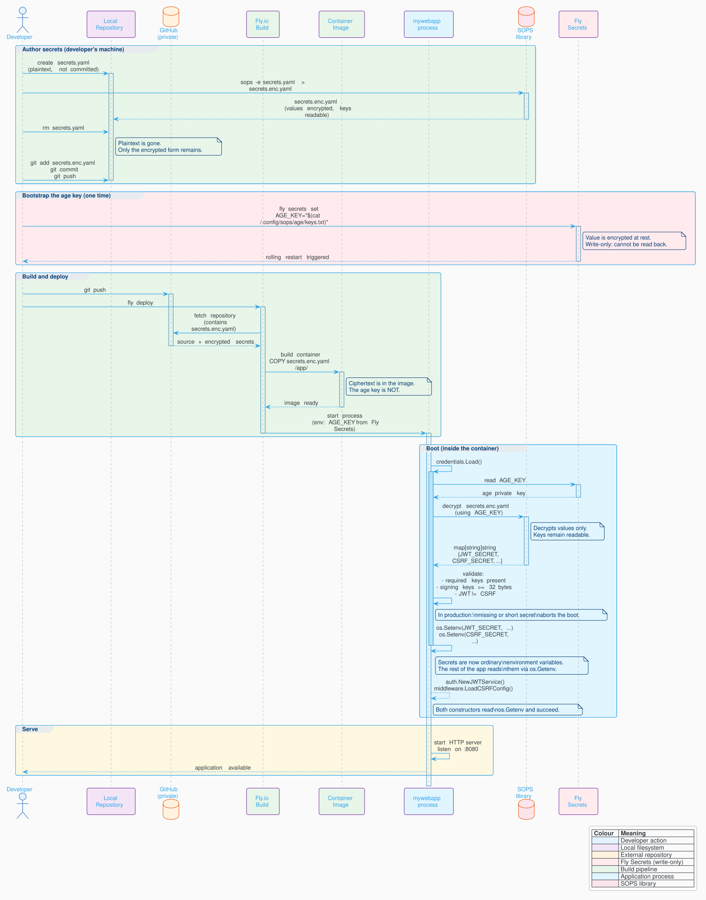

:doctype: article
:toc: left
:toc-title: Contents
:icons: font
:source-highlighter: coderay
:author_name: patrick toca
:author_email: link:mailto:[pmjtoca@gmail.com]
:stylesheet: ../../asciidoctor.css
:pdf-theme: ../../uked-theme.yml
:relfileprefix: ./
ifdef::env-github,env-browser[:outfilesuffix: .adoc]
:docdir: ../docs
:sectnums:
:sectnumlevels: 3

= Age, SOPS, and Fly.io: Setup and Operation

{author_name}
v0.8.1, October 6th, 2026

'''

Creation Date: October 6th, 2026

Author: {author_name}

Email: {author_email}

'''

<<<

== Purpose and scope

This document explains how `mywebapp` stores, encrypts, transports, and
loads its secrets, and how those secrets reach a running process in
production. It covers three tools and one small Go package:

* **age** — a file encryption tool. It generates a key pair and encrypts
  files to a recipient.
* **SOPS** — a tool that encrypts the *values* of a structured file
  (YAML, JSON, dotenv) while leaving the *keys* readable. It uses age (or
  another backend) as its cryptography.
* **Fly.io Secrets** — the platform's mechanism for injecting a small
  number of environment variables into a running machine, encrypted at
  rest and not readable back through the API.
* **`internal/credentials`** — the Go package in this repository that
  ties the three together. It reads the age private key from the
  environment, decrypts the SOPS file at boot, and sets each secret as an
  environment variable so the rest of the application reads secrets
  through `os.Getenv` exactly as it reads configuration.

By the end of this document you will be able to:

. Install age and SOPS on a development machine.
. Generate an age key pair and store the private key safely.
. Create and edit an encrypted secrets file that is safe to commit.
. Store the age private key as a Fly Secret.
. Deploy an application that decrypts its own secrets at boot.
. Rotate a secret without taking the application down.

<<<

== The design in one diagram

The flow of a secret from your editor to the running process:

[[fig-credentials-flow]]
.Request credentials flow with age, sops and fly in prod or in dev

The ciphertext is public. It lives in git, it is in the container image,
and anyone with a copy of the repository can see it. The **only** thing
that is secret is the age private key, which lives on your machine and in
Fly's encrypted vault, and nowhere else.

<<<

== Part 1 — age

=== What age is

age (pronounced "ah-gay", from the French *agé*) is a file encryption
tool. You give it a public key (a "recipient") and a file; it produces an
encrypted file that only the holder of the corresponding private key can
decrypt. It is deliberately small: no configuration file, no keyring, no
trust model beyond "you have the key or you do not."

SOPS uses age as one of its several cryptography backends. You do not
interact with age directly once SOPS is configured, except to generate
the key pair and to store the private key.

=== Install

On TUXEDO OS (and any Debian or Ubuntu derivative):

[source,bash]
----
sudo apt update
sudo apt install age
----

Verify:

[source,bash]
----
age --version
----

You should see `1.x` or later. If `apt` does not carry a recent enough
version, install the static binary from the release page:

[source,bash]
----
# Replace vX.Y.Z with the latest release tag from
# https://github.com/FiloSottile/age/releases
curl -LO https://github.com/FiloSottile/age/releases/download/vX.Y.Z/age-vX.Y.Z-linux-amd64.tar.gz
tar xzf age-vX.Y.Z-linux-amd64.tar.gz
sudo install -m 0755 age/age /usr/local/bin/age
sudo install -m 0755 age/age-keygen /usr/local/bin/age-keygen
----

=== Generate a key pair

[source,bash]
----
mkdir -p ~/.config/sops/age
age-keygen -o ~/.config/sops/age/keys.txt
----

The command prints the **public key** to stderr. It looks like:

[source]
----
# created: 2026-10-06T10:00:00Z
# public key: age1qz4m6k9...
AGE-SECRET-KEY-1QZ4M6K9...
----

The first line of output is a comment. The second line is the public key;
write it down. The file `~/.config/sops/age/keys.txt` contains the private
key. The format is two lines: a comment with the public key, then the
private key itself.

[WARNING]
====
Lose the private key and you lose the ability to decrypt every file that
was encrypted to it. There is no recovery mechanism. There is no "reset
password" link. If the key is gone, the ciphertext in your git history is
permanently unreadable.

Back the file up. Put a copy in a password manager, on an encrypted
USB stick, or somewhere else that is not the machine the file lives on.
====

=== Protect the private key

[source,bash]
----
chmod 600 ~/.config/sops/age/keys.txt
----

The `age` and `sops` tools refuse to read a key file with permissions
looser than this. The `chmod` is not optional.

=== The environment variable form

Some tools, including the SOPS library and the `internal/credentials`
package, accept the private key as an environment variable rather than a
file. The variable name is `AGE_KEY`. This is the form Fly.io uses:

[source,bash]
----
export AGE_KEY="$(cat ~/.config/sops/age/keys.txt)"
----

`internal/credentials` reads `AGE_KEY` first, then falls back to
`SOPS_AGE_KEY_FILE`, then to the default path
`~/.config/sops/age/keys.txt`. In development the file already exists, so
you do not need to set `AGE_KEY`. In a container the file does not exist,
so you do.

<<<

== Part 2 — SOPS

=== What SOPS is

SOPS ("Secrets OPerationS") encrypts the **values** in a structured file
while leaving the **keys** readable. A SOPS-encrypted YAML file looks
like this:

[source,yaml]
----
DB_PASSWORD: ENC[AES256_GCM,data:aBcD...,iv:...,tag:...,type:str]
JWT_SECRET: ENC[AES256_GCM,data:eFgH...,iv:...,tag:...,type:str]
CSRF_SECRET: ENC[AES256_GCM,data:iJkL...,iv:...,tag:...,type:str]
sops:
    age:
        - recipient: age1qz4m6k9...
          enc: |
            -----BEGIN AGE ENCRYPTED FILE-----
            ...
    lastmodified: "2026-10-06T10:00:00Z"
    mac: ENC[AES256_GCM,data:...,type:str]
    version: 3.8.1
----

Two properties follow from this:

. **`git diff` is meaningful.** Adding a key changes one line, and the
  line says which key. You can review a secrets change in a pull request
  the same way you review a code change.
. **You can add a key without decrypting the whole file.** The keys are
  readable; only the values need the age key.

=== Install

SOPS is not in the Debian or Ubuntu repositories. Install the binary from
the release page:

[source,bash]
----
# Replace vX.Y.Z with the latest release tag from
# https://github.com/getsops/sops/releases
curl -LO https://github.com/getsops/sops/releases/download/vX.Y.Z/sops-vX.Y.Z.linux.amd64
sudo install -m 0755 sops-vX.Y.Z.linux.amd64 /usr/local/bin/sops
----

Verify:

[source,bash]
----
sops --version
----

If you prefer to build from source:

[source,bash]
----
go install github.com/getsops/sops/v3/cmd/sops@latest
----

The binary lands in `$(go env GOPATH)/bin/sops`. Add that directory to
your `PATH` if it is not already there.

=== Create the encrypted file

Create the plaintext form first. The example below is what `mywebapp`
expects; replace the placeholder values with real ones.

[source,bash]
----
cat > secrets.yaml <<'EOF'
DB_PASSWORD: REPLACE_ME
TEST_DB_PASSWORD: REPLACE_ME
JWT_SECRET: REPLACE_ME
CSRF_SECRET: REPLACE_ME
R2_ACCESS_KEY_ID: REPLACE_ME
R2_SECRET_ACCESS_KEY: REPLACE_ME
EOF
----

Encrypt it to a file, then delete the plaintext:

[source,bash]
----
sops --encrypt secrets.yaml > secrets.enc.yaml
rm secrets.yaml
----

Verify that decryption works:

[source,bash]
----
sops --decrypt secrets.enc.yaml
----

You should see the same YAML you wrote, with the values in plaintext.

[NOTE]
====
The `.gitignore` in this repository already excludes `secrets.yaml`,
`secrets.yml`, and `secrets.env`. The plaintext file cannot be committed
by accident; the pattern is there as a guard, not as the only defence.
====

=== Editing the encrypted file

Do not decrypt to a file and re-encrypt. That leaves the plaintext on
disk and creates a window where it can be read by another process or
committed by a `git add .`.

Instead, edit the encrypted file directly:

[source,bash]
----
sops secrets.enc.yaml
----

`SOPS` decrypts the file to a temporary location, opens `$EDITOR` on it,
and on save re-encrypts the result back to `secrets.enc.yaml`. The
plaintext is only ever in the editor's memory and in the temp file, and
the temp file is deleted when the editor exits.

Set `$EDITOR` if it is not already set:

[source,bash]
----
export EDITOR=nvim   # or vim, nano, emacs, code --wait, ...
----

=== Adding a key

Open the file with `sops secrets.enc.yaml`, add a line in the editor, and
save. For example, to add a new secret called `SMTP_PASSWORD`:

[source,yaml]
----
SMTP_PASSWORD: hunter2
----

Save and exit. SOPS re-encrypts the file. The new key is present, its
value is encrypted.

If the application expects the new key, add it to the `knownSecrets`
list in `internal/credentials/credentials.go` so the loader will export
it into the environment. A key that is in the SOPS file but not in that
list is present in the decrypted map but not set as an environment
variable.

=== Rotating a value

Open the file, replace the value, save. Then commit and redeploy:

[source,bash]
----
sops secrets.enc.yaml
git add secrets.enc.yaml
git commit -m "rotate JWT secret"
git push
fly deploy
----

=== Viewing a single value without opening the file

For a quick check, without leaving a decrypted copy anywhere:

[source,bash]
----
sops --extract '["JWT_SECRET"]' --decrypt secrets.enc.yaml
----

The output is the value only. This is useful when you want to paste the
value into a shell command without opening an editor.

<<<

== Part 3 — Fly.io Secrets

=== What Fly Secrets are

Fly.io has a mechanism for injecting environment variables into a running
machine. It is encrypted at rest, and the values are **write-only**: once
set, neither `flyctl` nor the Fly API can read them back. The API servers
can encrypt but not decrypt. This is a deliberate design choice and it is
why Fly Secrets are suitable for the age private key.

The trade-off: you cannot audit the value of a Fly Secret through the
platform. If you forget what you set, you overwrite it. There is no
"show me the current value" command. For a bootstrap secret like `AGE_KEY`,
this is fine: the value is on your machine, and if you lose it you
re-upload it.

=== Install `flyctl`

[source,bash]
----
curl -L https://fly.io/install.sh | sh
----

The installer places `flyctl` in `~/.fly/bin`. Add it to your `PATH`:

[source,bash]
----
export FLYCTL_INSTALL="$HOME/.fly"
export PATH="$FLYCTL_INSTALL/bin:$PATH"
----

Add those two lines to your shell's startup file (`~/.zshrc` or
`~/.bashrc`) to make them permanent.

Authenticate:

[source,bash]
----
fly auth login
----

=== Setting a secret

[source,bash]
----
fly secrets set AGE_KEY="$(cat ~/.config/sops/age/keys.txt)" --app mywebapp
----

The `--app` flag is optional if `fly.toml` names the application, which
it does in this repository. The command:

. Sends the value over TLS to Fly's API.
. Stores it encrypted.
. Triggers a rolling restart of the application's machines so the new
   environment variable is visible to the next boot.

The restart is automatic and unavoidable. Setting a secret is a deploy in
miniature: the machines are replaced one at a time, with the new value
visible to the replacements and not to the originals.

=== Listing secret names

[source,bash]
----
fly secrets list --app mywebapp
----

The output shows the **names** and a digest (a short hash) of each
secret, not the values. The digest is stable for a given value, so you
can use it to confirm that a rotation took effect without reading the
value back.

=== Removing a secret

[source,bash]
----
fly secrets unset AGE_KEY --app mywebapp
----

Removing a secret also triggers a rolling restart. The next boot will
fail with "no age key available" if the application still needs it, which
is the fail-closed behaviour `internal/credentials` is designed for.

=== The bulk form

If you have multiple secrets to set at once, `fly secrets import` reads
them from stdin in dotenv format:

[source,bash]
----
fly secrets import --app mywebapp < .secrets.env
----

For `mywebapp`, only `AGE_KEY` needs to be set this way. Everything else
lives in `secrets.enc.yaml`, which is decrypted at boot. Adding the other
secrets to Fly's vault would create a second source of truth and defeat
the point of the design.

<<<

== Part 4 — The `internal/credentials` package

=== What the package does

The package has one exported function, `Load()`, and one responsibility:
to make the application's secrets visible in the process environment
before any service is constructed.

[source,go]
----
func Load() error
----

`Load` performs four steps in order:

. Ensures the age private key is available to the SOPS library. It reads
  `AGE_KEY` from the environment and sets `SOPS_AGE_KEY` from it. If
  `AGE_KEY` is absent, it checks `SOPS_AGE_KEY_FILE` and the default
  path. If no key is found, it returns an error.
. Decrypts `secrets.enc.yaml` using the SOPS library.
. Validates that the secrets the application requires are present and,
   for signing keys, at least 32 bytes long.
. Exports each secret in the `knownSecrets` list into the process
   environment with `os.Setenv`.

The rest of the application does not know about SOPS, age, or Fly. It
reads `JWT_SECRET`, `CSRF_SECRET`, and `DB_PASSWORD` through `os.Getenv`,
the same way it reads `DB_HOST` and `PORT`. The distinction between
configuration and secrets is in where the values come from, not in how
the code consumes them.

=== Fail-closed behaviour

In production and staging (`APP_ENV` set to `production` or `staging`),
`Load` returns an error and `main` exits in any of these cases:

* `secrets.enc.yaml` is missing.
* No age key is available.
* `JWT_SECRET` or `CSRF_SECRET` is missing from the file.
* `JWT_SECRET` or `CSRF_SECRET` is shorter than 32 bytes.
* `JWT_SECRET` and `CSRF_SECRET` are the same value.

In development (`APP_ENV` unset, or set to `development`), the same
conditions produce warnings instead. The process starts. The consumer's
own fallback applies: `auth.NewJWTService` and
`middleware.LoadCSRFConfig` each generate a random per-process value when
the corresponding variable is empty. That is what makes `go run` work
without ceremony, and the warning is what makes the missing secret
visible.

=== Adding a new secret

Three edits, always in the same three places:

. Add the key and its value to `secrets.enc.yaml`. Use
  `sops secrets.enc.yaml` to edit the file in place.
. Add the key's name to the `knownSecrets` slice in
  `internal/credentials/credentials.go`.
. Add a read of the key where the application needs it:
   `os.Getenv("MY_NEW_SECRET")`.

The `knownSecrets` list is a closed set. A key that is in the encrypted
file but not in the list is present in the decrypted map but not exported
as an environment variable. This is deliberate: it means a typo in the
encrypted file does not silently become a live environment variable.

<<<

== Part 5 — Day-to-day operations

=== First-time setup on a new machine

[source,bash]
----
# 1. Install age and SOPS (see Parts 1 and 2).

# 2. Restore the age private key. If you backed it up in a password
#    manager, retrieve it and write it to the default location.
mkdir -p ~/.config/sops/age
$EDITOR ~/.config/sops/age/keys.txt
chmod 600 ~/.config/sops/age/keys.txt

# 3. Clone the repository.
git clone git@github.com:you/mywebapp.git
cd mywebapp

# 4. Verify the SOPS file decrypts.
sops --decrypt secrets.enc.yaml > /dev/null && echo "ok"

# 5. Create the local configuration.
cp .env.example .env
$EDITOR .env

# 6. Run.
go run ./cmd/api
----

If step 4 fails, the age key on this machine does not match the one the
file was encrypted to. Recover the correct key or re-encrypt the file to
the new machine's public key. There is no way to decrypt a file without
the private key it was encrypted to.

=== Rotating the age key

Rotating the age key means re-encrypting the SOPS file to a new recipient
and changing the `AGE_KEY` secret on Fly. Existing ciphertext encrypted
to the old key cannot be decrypted with the new one, so the re-encryption
must happen before the old key is discarded.

[source,bash]
----
# 1. Generate a new key pair.
age-keygen -o ~/.config/sops/age/keys-new.txt
# Note the new public key: age1...

# 2. Re-encrypt the SOPS file to the new recipient, keeping the old one
#    as a fallback in case the new key is lost.
sops --add-age age1newpublickey... secrets.enc.yaml

# 3. Verify the new key can decrypt.
SOPS_AGE_KEY_FILE=~/.config/sops/age/keys-new.txt \
    sops --decrypt secrets.enc.yaml > /dev/null

# 4. Update Fly.
fly secrets set AGE_KEY="$(cat ~/.config/sops/age/keys-new.txt)"

# 5. Deploy.
git add secrets.enc.yaml
git commit -m "re-encrypt secrets to new age key"
git push
fly deploy

# 6. Once the deployment is confirmed healthy, remove the old recipient.
sops --rm-age age1oldpublickey... secrets.enc.yaml
git add secrets.enc.yaml
git commit -m "remove old age recipient"
fly deploy

# 7. Replace the local key file.
mv ~/.config/sops/age/keys-new.txt ~/.config/sops/age/keys.txt
----

Step 2 keeps both recipients. If the new key is lost between step 2 and
step 6, the old key still decrypts the file. Step 6 removes the old
recipient once the new one is confirmed working.

=== Rotating a secret without rotating the key

The common case. Open the SOPS file, replace the value, commit, redeploy.

[source,bash]
----
sops secrets.enc.yaml
git add secrets.enc.yaml
git commit -m "rotate JWT_SECRET"
git push
fly deploy
----

A JWT secret rotation invalidates every existing access and refresh
token. Users must log in again. That is the correct behaviour; a rotated
secret that did not invalidate tokens would not be a rotation.

A CSRF secret rotation invalidates every issued CSRF cookie. Users get a
fresh one on their next GET. No user-visible effect.

=== Checking what is deployed

[source,bash]
----
# Which age recipients can decrypt the committed file?
sops --extract '["sops"]["age"]' --decrypt-keys secrets.enc.yaml

# What is the digest of the current AGE_KEY on Fly?
fly secrets list --app mywebapp

# What does the application see at boot?
fly logs --app mywebapp | grep -i credential
----

The application logs a line at boot:

[source]
----
INFO credentials loaded count=6
----

`count` is the number of secrets exported into the environment. If it is
lower than the number of keys in `secrets.enc.yaml`, at least one key is
not in the `knownSecrets` list and is being silently ignored.

<<<

== Part 6 — Troubleshooting

=== `no age key available`

The error from `credentials.Load`. Causes, in order of likelihood:

. `AGE_KEY` is unset on Fly. Check `fly secrets list`.
. The age key file at `~/.config/sops/age/keys.txt` is missing or has
   permissions looser than `0600`.
. `SOPS_AGE_KEY_FILE` is set to a path that does not exist.

=== `failed to decrypt secrets.enc.yaml: no identity matched any of the recipients`

The age key on this machine is not the one the file was encrypted to.
Either you are on a machine with the wrong key, or the file was
re-encrypted after the key was generated. Retrieve the correct key, or
re-encrypt the file to the current machine's public key.

=== `required secret JWT_SECRET is missing from secrets.enc.yaml`

The key is absent from the file. Add it with `sops secrets.enc.yaml`, or,
if this is development, accept the warning and let the fallback apply.

=== `secret JWT_SECRET is 18 bytes; need at least 32 in production`

The value is too short. Regenerate with `openssl rand -base64 48` and
update the file.

=== `JWT_SECRET and CSRF_SECRET are the same value; they must differ`

Both keys hold the same string. They serve different purposes and must
be different. Regenerate one of them.

=== `credentials loaded count=2` but the file has six keys

Only two keys are in the `knownSecrets` list. Add the others. The count
is the number of keys the loader exported, not the number the file
contains.

=== The application starts but login fails with "invalid token"

The `JWT_SECRET` the running process sees is different from the one that
issued the token. Either the secret was rotated between the token being
issued and the request, or the deployment is running with a stale
environment. Check `fly logs` for the boot sequence and confirm
`credentials.Load` ran before `auth.NewJWTService`.

<<<

== Part 7 — What not to do

* **Do not commit `secrets.yaml`.** It is the plaintext form. The
   `.gitignore` catches it, but the pattern is a guard, not a guarantee.
   Verify with `git status --short` before every commit that touches
   secrets.

* **Do not decrypt to a file and re-encrypt.** Use `sops secrets.enc.yaml`
   and edit in place. The decrypt-to-file workflow leaves plaintext on
   disk.

* **Do not put secrets in `.env`.** The `.env` file holds configuration
   only. A secret in `.env` is a secret in two places, and the second
   place is not encrypted.

* **Do not put secrets in `fly.toml` `[env]`.** The `[env]` block is
   visible in the Fly dashboard and in the `fly.toml` file itself. Only
   `AGE_KEY` should be a Fly Secret, and only because it is the bootstrap
   key that decrypts everything else.

* **Do not reuse the age key across projects.** One key per project
   limits the blast radius of a compromise. If you have three projects,
   you have three age keys, each stored as the `AGE_KEY` secret of the
   corresponding Fly application.

* **Do not lose the age private key.** There is no recovery. If the key
   is gone, the ciphertext in the repository is unreadable and the
   secrets must be regenerated from scratch and re-encrypted to a new
   key. The application can survive this if the new secrets are written
   to a new SOPS file and deployed; it cannot survive losing the *values*
   if they are only in the SOPS file. Keep a backup.

<<<

== Part 8 — Files referenced by this document

[cols="1,3"]
|===
| Path | Purpose

| `secrets.enc.yaml`
| The committed, encrypted secrets file. Edited with `sops secrets.enc.yaml`.

| `secrets.yaml`
| The plaintext working copy. Created by `sops` during editing, deleted
  on exit. Gitignored.

| `~/.config/sops/age/keys.txt`
| The age private key on a developer machine. Mode `0600`.

| `internal/credentials/credentials.go`
| The loader. Reads `AGE_KEY`, decrypts the SOPS file, exports the
  secrets into the environment.

| `internal/credentials/parse.go`
| The YAML parser used by the loader.

| `.env`
| Non-secret configuration. Gitignored. Copy of `.env.example`.

| `.env.example`
| The committed template for `.env`.

| `fly.toml`
| The Fly application manifest. Contains non-secret configuration in
  `[env]`. Does not contain secrets.

| `AGE_KEY`
| The Fly Secret holding the age private key. Set with
  `fly secrets set AGE_KEY=...`.
|===

<<<

== Appendix — Command reference

[cols="1,3"]
|===
| Command | Effect

| `age-keygen -o FILE`
| Generate a new age key pair, writing the private key to `FILE` and
  printing the public key to stderr.

| `sops FILE`
| Edit `FILE` in place. Decrypts to a temp file, opens `$EDITOR`,
  re-encrypts on save.

| `sops --decrypt FILE`
| Decrypt to stdout. Leaves no file on disk.

| `sops --encrypt FILE`
| Encrypt to stdout. Does not modify `FILE`.

| `sops --extract '["KEY"]' --decrypt FILE`
| Decrypt a single value.

| `sops --add-age RECIPIENT FILE`
| Add a new age recipient. The file remains decryptable by all existing
  recipients as well.

| `sops --rm-age RECIPIENT FILE`
| Remove an age recipient. The file is no longer decryptable with that
  key.

| `fly secrets set KEY=VALUE`
| Set a secret. Triggers a rolling restart.

| `fly secrets list`
| List secret names and digests. Values are not retrievable.

| `fly secrets unset KEY`
| Remove a secret. Triggers a rolling restart.

| `fly logs`
| Stream the application's logs.

| `fly deploy`
| Build and deploy the current directory.
|===

<<<

== Appendix — Environment variables read by `internal/credentials`

[cols="2,1,3"]
|===
| Variable | Required | Meaning

| `AGE_KEY`
| In containers
| The age private key, as a value. Read first. In development this is
  unset and the loader falls back to the key file.

| `SOPS_AGE_KEY`
| No
| Set by the loader from `AGE_KEY`. The SOPS library reads this.

| `SOPS_AGE_KEY_FILE`
| No
| A path to a file containing the age private key. Read if `AGE_KEY` is
  unset.

| `APP_ENV`
| In production
| `development`, `staging`, or `production`. Governs the fail-closed
  behaviour: production and staging refuse to start on a missing or
  short secret; development warns.

| `XDG_CONFIG_HOME`
| No
| Honoured when locating the default age key path. If unset,
  `$HOME/.config` is used.
|===

<<<

== Appendix — The `secrets.enc.yaml` schema

The file is a single-level YAML mapping of string keys to string
values. The loader rejects nested maps: a secret is a scalar.

[source,yaml]
----
DB_PASSWORD: string
TEST_DB_PASSWORD: string
JWT_SECRET: string       # at least 32 bytes in production
CSRF_SECRET: string      # at least 32 bytes, different from JWT_SECRET
R2_ACCESS_KEY_ID: string
R2_SECRET_ACCESS_KEY: string
----

The `knownSecrets` list in `internal/credentials/credentials.go` names
the keys the loader exports into the environment. It is a closed set:
a key in the file that is not on the list is silently ignored, and a key
on the list that is not in the file is a hard error in production.

When you add a secret, edit the file **and** the list. The two must
agree.
