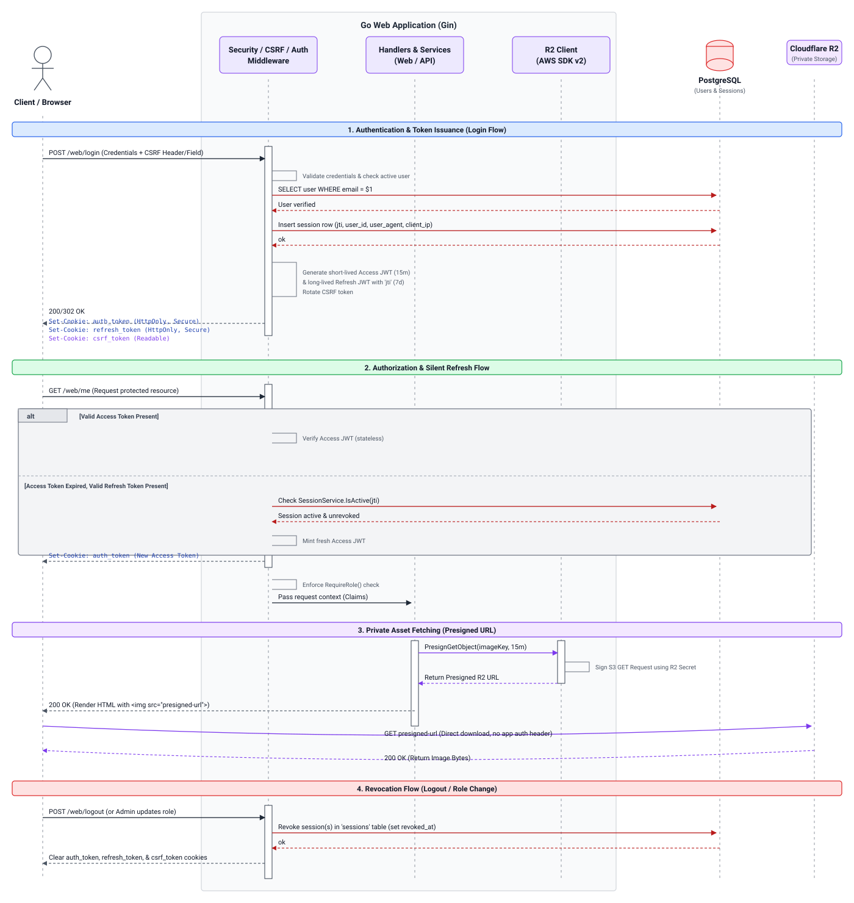

:doctype: article
:toc: left
:toc-title: Contents
:icons: font
:source-highlighter: coderay
:author_name: patrick toca
:author_email: link:mailto:[pmjtoca@gmail.com]
:stylesheet: ../../asciidoctor.css
:pdf-theme: ../../uked-theme.yml
:relfileprefix: ./
ifdef::env-github,env-browser[:outfilesuffix: .adoc]
:docdir: ../docs
:sectnums:
:sectnumlevels: 3
:keywords: go, gin, htmx, tailwind, postgresql, sqlc, slog, jwt, rate limiting, gzip, clean architecture, csp, hsts, cookies, samesite, csrf, double-submit, hmac, access-token, refresh-token, session, revocation, authorization, rbac, cloudflare, r2, presigned-url, dataflow, versioning, home-page, members, testing, test-database
:sectanchors:
:sectlinks:
:highlightjs-languages: go,bash,properties,sql
:experimental:

= HTTP Security Headers, Secure Cookies, CSRF Protection, JWT Token Scheme, Authorization, and Version Metadata

{author_name}
v0.8.1, October 5th, 2026

'''

Creation Date: September 6th, 2026

Author: {author_name}

Email: {author_email}

<<<

== Overview

The `SecurityHeaders` middleware (`pass:[internal/middleware/security_headers.go]`) sets defence-in-depth HTTP response headers on every request, `pass:[internal/web/cookies.go]` controls the attributes on the auth and CSRF cookies, `pass:[internal/middleware/csrf.go]` enforces the signed double-submit cookie pattern on every mutating request, `pass:[internal/auth/jwt.go]` issues short-lived access tokens with long-lived, revocable refresh tokens, `pass:[internal/middleware/require_role.go]` enforces role-based authorization, `pass:[pkg/r2/client.go]` serves a private welcome image from Cloudflare R2 through presigned URLs, and `pass:[internal/version/version.go]` injects git-derived build metadata exposed publicly at `GET /version`. A separate test database environment (`pass:[internal/testutil]`) exercises the whole stack against an isolated PostgreSQL instance.

<<<

== Scope

This document covers seven related defence-in-depth and operational
changes:

. **HTTP security headers** — set on every response by the
  `SecurityHeaders` middleware in
  `pass:[internal/middleware/security_headers.go]`, registered
  immediately after `RequestID` in `pass:[cmd/api/main.go]`.
. **Secure cookie attributes** — applied to the auth, refresh, and
  CSRF cookies by the helpers in `pass:[internal/web/cookies.go]`, used
  by `pass:[internal/web/auth_handler.go]` on login, register, and
  logout.
. **CSRF protection** — enforced by `CSRFMiddleware` in
  `pass:[internal/middleware/csrf.go]` using the signed double-submit
  cookie pattern, with token rotation on authentication and HMAC
  signing over the token body.
. **JWT token scheme** — short-lived access tokens and long-lived
  revocable refresh tokens, implemented in
  `pass:[internal/auth/jwt.go]` and
  `pass:[internal/service/session_service.go]`, with a `sessions` table
  for server-side revocation. The middleware reloads the user from the
  database on silent refresh so role and activation changes take effect
  on the next request.
. **Role-based authorization and public/self-service routing** —
  enforced by `pass:[internal/middleware/require_role.go]`. Since
  v0.7.0 the public surface is `/` and `/web/home`; the read-only
  member directory is `/web/members`; the self-service page is
  `/web/me`; the admin-only surface remains under `/web/users` and
  `/api/v1/users`. Since v0.8.1, `/api/*` accepts only Bearer tokens.
. **Private R2 welcome image** — served from Cloudflare R2 through
  short-lived presigned URLs generated by `pass:[pkg/r2/client.go]`.
. **Version metadata** — injected at build time by `-ldflags -X` into
  `pass:[internal/version/version.go]` and exposed at `GET /version`.
  This is not a security control, but the endpoint is public and is
  documented here for completeness.

All seven are controlled entirely by environment variables and default
to safe values. Local HTTP development overrides two of them via
`.env`.

The runtime interaction between these components is shown in
<<dataflow-diagram>>.

<<<

[[dataflow-diagram]]
== Data-Flow Diagram

The following diagram shows how a request moves through the
application, and how the flows interlock: authentication and token
issuance, authorization with silent refresh, private asset fetching
through presigned URLs, and revocation.

[[fig-dataflow]]
.Request lifecycle across the middleware chain, handlers, services, and external systems

The diagram is organised as four vertical swim lanes:

Client / Browser::
  The end user's browser. Issues HTTP requests to the application and
  receives responses. Holds all three cookies (`auth_token`,
  `refresh_token`, `csrf_token`).

Go Web Application (Gin)::
  The server process. Contains the middleware chain
  (SecurityHeaders, CSRF, Auth, RequireRole), the handlers, the
  services, and the R2 client.

PostgreSQL::
  The database. Holds the `users` table and the `sessions` table. The
  application reads and writes both.

Cloudflare R2 (Private Storage)::
  The object storage bucket. Holds the welcome image. Presigned URLs
  are generated by the server; the image bytes are fetched directly by
  the browser.

=== Flow 1 — Authentication and token issuance

Triggered by a `POST /web/login`. The client sends credentials plus a
CSRF token, either in the form body or in the `X-CSRF-Token` header.
The middleware chain validates the CSRF token (including its HMAC
signature), then the handler verifies the credentials against the
`users` table. On success, the handler inserts a row into the
`sessions` table with the refresh token's `jti`, then mints a
short-lived access token and a long-lived refresh token. The CSRF
token is rotated. The response sets three cookies and returns `200`
for HTMX or `302` for browser navigation, both pointing at
`/web/home`.

The relevant sections are <<csrf-protection>>, <<jwt-token-scheme>>,
and <<secure-cookie-attributes>>.

=== Flow 2 — Authorization and silent refresh

Triggered by any request to a protected route, for example
`GET /web/members`. `AuthMiddleware` runs first and tries three paths
in order: a Bearer token in the `Authorization` header, a valid
`auth_token` cookie, or a `refresh_token` cookie that can be exchanged
for a new access token. The middle path is the common one. The third
path is the silent refresh: if the access token has expired but the
refresh token is valid and unrevoked, the middleware reloads the user
from the database, mints a fresh access token carrying the current role
and activation status, and sets it on the response.

After `AuthMiddleware` populates the claims, `RequireRole` runs on the
admin-only groups. A non-admin reaching an admin route is rejected
before the handler runs. The public and authenticated groups do not
have `RequireRole` registered.

API paths under `/api` accept only Bearer tokens. Cookie authentication
is refused on those paths, because the API group has no CSRF middleware
and accepting cookies there would expose the JSON endpoints to CSRF.

The public home page uses `OptionalAuthMiddleware` instead: it reads
claims when a valid access token is present and does nothing
otherwise. It never aborts, so anonymous visitors reach the page.

The relevant sections are <<jwt-token-scheme>> and <<authorization>>.

=== Flow 3 — Private asset fetching

Triggered when `MeHandler.ProfilePage` renders the welcome page. The
handler calls the R2 client's `PresignGetObject` method, which
generates a signed URL valid for 15 minutes. The URL is passed to the
template and rendered as an `img` element. The browser then fetches
the image directly from R2 — the Go server never proxies the bytes.
The R2 credentials stay on the server; only the short-lived signed URL
is exposed.

The relevant section is <<r2-welcome-image>>.

=== Flow 4 — Revocation

Triggered by logout, a role change, account deactivation, or account
deletion. In each case, the corresponding `sessions` rows are marked
with a non-null `revoked_at` timestamp. The next refresh attempt using
a revoked token fails at `SessionService.IsActive`, and the user must
log in again. Logout additionally clears all three cookies. The logout
handler parses the refresh cookie to obtain the `jti` before revoking,
since the access token does not carry one.

The relevant section is <<jwt-token-scheme>>, specifically the
"Revocation triggers" subsection.

<<<

== HTTP Security Headers

=== What it sets

[cols="2,2,4",options="header"]
|===
| Header | Default | Purpose

| `Content-Security-Policy(-Report-Only)`
| see <<the-content-security-policy>>
| Restricts resource loading; mitigates XSS and data injection

| `Strict-Transport-Security`
| disabled (`HSTS_MAX_AGE=0`)
| Forces HTTPS for future visits

| `X-Frame-Options`
| `DENY`
| Clickjacking defence (legacy browsers)

| `X-Content-Type-Options`
| `nosniff`
| Blocks MIME sniffing

| `Referrer-Policy`
| `strict-origin-when-cross-origin`
| Limits referrer leakage

| `Permissions-Policy`
| camera/mic/geo/etc. disabled
| Disables unused browser features

| `Cross-Origin-Opener-Policy`
| `same-origin`
| Process isolation

| `Cross-Origin-Resource-Policy`
| `same-origin`
| Blocks cross-origin reads
|===

[[the-content-security-policy]]
=== The Content-Security-Policy

The policy is tailored to this stack (Gin, HTMX 1.9, Tailwind 3):

[source,text]
----
default-src 'self';
script-src 'self' 'unsafe-inline' 'unsafe-eval';
style-src 'self' 'unsafe-inline';
img-src 'self' data: https://*.r2.cloudflarestorage.com;
font-src 'self' data:;
connect-src 'self';
media-src 'self';
object-src 'none';
base-uri 'self';
form-action 'self';
frame-ancestors 'none';
upgrade-insecure-requests
----

NOTE: The `img-src` directive includes the R2 hostname so the welcome
page can load the presigned image URL from R2. If you serve the image
through a custom domain in front of the bucket, replace the R2 hostname
with that domain in `img-src`. Be aware that attaching a custom domain
to a bucket also makes the objects reachable through it — see the
discussion in <<r2-welcome-image>> for the trade-off between a custom
domain and a private bucket.

==== Why 'unsafe-inline' and 'unsafe-eval' in script-src?

* HTMX 1.9 injects inline `script` elements for template fragments and
  evaluates `hx-on:*`, `hx-vals`, and `hx-vars` expressions via
  `new Function(...)`.
* `base.html`, `home.html`, `login_form.html`, and
  `register_form.html` contain inline `script` blocks for toasts, the
  password toggle, and HTMX lifecycle hooks.

Removing `'unsafe-eval'` would require dropping `hx-on:*` and `hx-vals`
usage. Removing `'unsafe-inline'` would require nonces or hashes on
every inline script. Both are follow-up work — this middleware lands
the baseline first.

==== Why 'unsafe-inline' in style-src?

* `base.html`, `home.html`, `login.html`, `register.html`, and
  `me.html` have inline `style` blocks (`.htmx-indicator`, `.fade-in`,
  `.toast`).

=== Configuration

All via environment variables. Defaults are safe for production.

[cols="3,2,4",options="header"]
|===
| Env var | Default | Notes

| `CSP_REPORT_ONLY`
| `true`
| Set to `false` in production

| `CSP_REPORT_URI`
| _(empty)_
| For example a URL under your own domain that accepts reports

| `HSTS_MAX_AGE`
| `0`
| Set to `31536000` (1 year) in production

| `HSTS_INCLUDE_SUBDOMAINS`
| `false`
| Adds `includeSubDomains` to HSTS

| `HSTS_PRELOAD`
| `false`
| Adds `preload`; implies `includeSubDomains`

| `X_FRAME_OPTIONS`
| `DENY`
| `DENY` or `SAMEORIGIN`

| `REFERRER_POLICY`
| `strict-origin-when-cross-origin`
| See MDN for accepted values

| `PERMISSIONS_POLICY`
| see code
| Feature policy directives

| `COOP`
| `same-origin`
| Cross-Origin-Opener-Policy

| `CORP`
| `same-origin`
| Cross-Origin-Resource-Policy
|===

<<<

[[secure-cookie-attributes]]
== Secure Cookie Attributes

Three cookies are set by the application:

. **`auth_token`** — the short-lived access token (JWT). HttpOnly.
. **`refresh_token`** — the long-lived refresh token (JWT with `jti`).
  HttpOnly.
. **`csrf_token`** — the CSRF token, now signed with HMAC-SHA256.
  **Not** HttpOnly, so the client-side JavaScript can read it.

All three are written and cleared by helpers in
`pass:[internal/web/cookies.go]`. Transport-level attributes (Secure,
SameSite, Domain, Path) are resolved once at process start by
`LoadCookieConfig()` and applied consistently to all three.

=== What it sets

[cols="1,2,2,4",options="header"]
|===
| Cookie | Attribute | Default | Purpose

.4+| `auth_token`
| `HttpOnly`
| always `true`
| Cookie is never readable from JavaScript; blocks XSS token theft
| `Max-Age`
| `JWT_ACCESS_TTL` (default 15m)
| Short by design; matches the access token's `exp`
| `Secure`
| `COOKIE_SECURE` (code default `true`, `.env` template `false`)
| Cookie only sent over HTTPS
| `SameSite`
| `COOKIE_SAMESITE` (default `Lax`)
| Blocks cross-site POST CSRF

.4+| `refresh_token`
| `HttpOnly`
| always `true`
| Same XSS-protection rationale as `auth_token`
| `Max-Age`
| `JWT_REFRESH_TTL` (default 168h, 7 days)
| Long by design; keeps the user logged in across browser sessions
| `Secure`
| `COOKIE_SECURE`
| Cookie only sent over HTTPS
| `SameSite`
| `COOKIE_SAMESITE` (default `Lax`)
| Blocks cross-site POST CSRF

.4+| `csrf_token`
| `HttpOnly`
| always `false`
| **Must** be readable by JavaScript for the double-submit pattern
| `Max-Age`
| `0`
| Session cookie; deleted when the browser closes
| `Secure`
| `COOKIE_SECURE`
| Cookie only sent over HTTPS
| `SameSite`
| `COOKIE_SAMESITE` (default `Lax`)
| Blocks cross-site POST CSRF
|===

All three cookies also carry `Path=/` and, if configured,
`Domain=COOKIE_DOMAIN`.

=== Why these values?

**HttpOnly is unconditional on the auth and refresh cookies.** Both
hold JWTs. If JavaScript can read either, an XSS bug becomes a full
account takeover. There is no legitimate reason for the browser to
expose either cookie to script, so the attribute is hardcoded rather
than configurable.

**HttpOnly is deliberately false on the CSRF cookie.** The
double-submit pattern requires the client-side JavaScript to read the
token from the cookie and copy it into a request header. This is safe
because the CSRF token is not a credential: it grants no access on its
own.

**Secure is gated on `COOKIE_SECURE`.** The code default is `true`, so
an unset environment cannot accidentally ship an insecure cookie. The
`.env` template ships with `false` because it is meant for local HTTP
development, and the accompanying warning tells the reader to change
it before deploying.

**SameSite=Lax is the right default for a server-rendered HTMX app.**
Lax blocks the cookie from being attached to cross-site POST requests
while still allowing it on top-level navigations.

**Max-Age on the auth cookie matches `JWT_ACCESS_TTL`.** The cookie
must not outlive the token it carries, or the browser will send a token
the server has already rejected. The same applies to the refresh cookie
and `RefreshTTL()`.

**Empty Domain means host-only.** For localhost and for a
single-hostname deployment, this is exactly right. If you later serve
two hostnames and want the cookies shared across both, set
`COOKIE_DOMAIN` to the common parent domain.

=== Configuration

[cols="3,2,4",options="header"]
|===
| Env var | Default | Notes

| `COOKIE_SECURE`
| `true` in code, `false` in the `.env` template
| Code default is safe; the template's `false` is for local dev only

| `COOKIE_SAMESITE`
| `lax`
| `lax`, `strict`, or `none`; unknown values fall back to `lax`

| `COOKIE_DOMAIN`
| _(empty)_
| Empty is host-only. Set to the parent domain for cross-subdomain
  sharing.
|===

WARNING: If you run over plain HTTP and leave `COOKIE_SECURE=true`, the
browser will accept the Set-Cookie on login but silently refuse to
send the cookies back on the next request — you will appear logged in
for one response and then logged out. Always set
`COOKIE_SECURE=false` in `.env` for local dev, and set it to `true` in
production where HTTPS is enforced.

<<<

[[csrf-protection]]
== CSRF Protection

Cross-Site Request Forgery (CSRF) is an attack in which a malicious page
causes the victim's browser to issue a request to your application
while the victim is authenticated. The browser automatically attaches
cookies to the request, so the server cannot distinguish it from a
legitimate request by the user.

This section describes the defence implemented in
`pass:[internal/middleware/csrf.go]`. The interaction with the other
middleware is shown in <<dataflow-diagram>>, Flow 1.

=== The signed double-submit cookie pattern

The middleware uses the double-submit cookie pattern, with a signed
token. On a safe-method request (GET, HEAD, OPTIONS, TRACE):

. If the request carries no `csrf_token` cookie, or if the one it
  carries fails signature verification, a fresh token is generated
  (32 random bytes from `crypto/rand`, base64url-encoded) and signed
  with HMAC-SHA256 under the server's `CSRF_SECRET`.
. The signed token is set on the response as a readable cookie.
. The token is also stashed in the gin context so server-rendered
  forms can embed it as a hidden field.

On a mutating request (POST, PUT, PATCH, DELETE):

. The middleware reads the token from the `X-CSRF-Token` header first,
  then falls back to the form body field `csrf_token`.
. It verifies the cookie's HMAC signature. A cookie whose signature
  does not verify is rejected even if the submitted token matches the
  cookie value exactly.
. It compares the submitted token against the cookie using
  `subtle.ConstantTimeCompare`, which is timing-safe.
. On any failure, the request is rejected with `403` before the
  handler runs.

Two attacker paths are closed by the signature that the plain
double-submit pattern leaves open:

* **Cookie tossing.** An attacker who can set a cookie on a sibling
  subdomain of the target can plant a `csrf_token` value of their
  choosing. Without a signature, the server compares the submitted
  token against the planted cookie and finds them equal — and accepts
  the request. With a signature, the planted cookie fails verification
  and the request is refused.
* **Token guessing.** A token without a signature is just a random
  string. The signature lets the server confirm on sight that a token
  originated from itself.

The signed token is the string formed by concatenating the base64url
body, a dot, and the base64url HMAC of the body. `verifyToken`
recomputes the HMAC and compares in constant time.

=== Why not the synchronizer token pattern?

The synchronizer pattern stores the token server-side, keyed by
session, and compares the submitted token against the stored one. It is
stronger against token theft — the token never leaves the server — but
it requires server-side session state. Until this release, the
application had no server-side session store, so the signed
double-submit pattern was the appropriate stateless option.

The `sessions` table introduced in the JWT token scheme (see
<<jwt-token-scheme>>) is keyed by refresh-token `jti`, not by CSRF
token. It could be extended to store per-session CSRF tokens, migrating
the application to the synchronizer pattern. That is a follow-up
change, not part of this release.

=== Token rotation on authentication

On successful login or registration, the CSRF token is rotated: the
pre-auth cookie is cleared with Max-Age 0 and a fresh signed token is
issued. This closes the session fixation window.

Rotation is implemented in `AuthHandler.rotateCSRFToken`, called from
both `Login` and `Register` via `issueTokens`. The two Set-Cookie
headers — one clearing the old token, one setting the new one — are
visible in the login response.

The rotated token is signed with the same `CSRF_SECRET` as the
middleware uses, so it verifies on subsequent requests. When
`CSRF_SECRET` is not set, both the handler and the middleware generate
their own random key at startup and the signatures will not match. In
that case, set `CSRF_SECRET` in the environment (see
<<csrf-configuration>>). The correct long-term fix is to load the
config once at startup and pass it to both the middleware and the
handler; that change is scheduled for a future release.

=== Bearer-token requests are exempt

The middleware skips validation for requests that `AuthMiddleware` has
marked as Bearer-authenticated. The marking is performed by
`middleware.MarkBearerAuthenticated`, called from `AuthMiddleware`
immediately after the Bearer token has been validated.

A request that merely carries a Bearer header without a valid token is
not marked, and is therefore subject to the same CSRF validation as any
other request. The previous implementation exempted any request whose
`Authorization` header started with `Bearer `, which was too
permissive on the public routes: a request to `POST /web/login` with a
dummy Bearer header would have bypassed CSRF even though no token had
been validated.

=== Where the token lives in templates

Native HTML form submissions (login, register, user create and edit)::
  The handler passes the token into the template as `{{.csrf_token}}`,
  rendered as a hidden input field named `csrf_token`.

HTMX requests (delete, and any future hx-put or hx-delete)::
  A `htmx:configRequest` listener in `base.html` and `home.html` reads
  the token from the cookie and injects it as the `X-CSRF-Token` header
  on every HTMX request.

The `htmx:configRequest` injection is the single most important design
choice in this facility. It decouples CSRF from individual templates.

=== Middleware registration order

CSRF is registered in several places in `pass:[cmd/api/main.go]`:

. **`GET /`, `GET /web/home`, `GET /web/login`, `GET /web/register`**
  — sets the `csrf_token` cookie on the first page render.
. **`POST /web/login`, `POST /web/register`, `POST /web/logout`** —
  validates the submitted token before the handler runs.
. **`/web/members`, `/web/me`, `/web/users/*`** — registered after
  `authMW`, so unauthenticated requests are rejected before CSRF is
  checked. Admin routes additionally run `RequireRole` first.

[[csrf-configuration]]
=== Configuration

[cols="3,2,4",options="header"]
|===
| Env var | Default | Notes

| `CSRF_FORM_FIELD`
| `csrf_token`
| Hidden input name in forms; must match the template

| `CSRF_HEADER_NAME`
| `X-CSRF-Token`
| Header HTMX and API clients send

| `CSRF_TOKEN_LENGTH`
| `32`
| Bytes of entropy in the token body. Do not lower below 16

| `CSRF_COOKIE_MAX_AGE`
| `0`
| Seconds. `0` means a session cookie. A negative value is not used; it
  would delete the cookie immediately.

| `CSRF_SECRET`
| _(empty)_
| HMAC signing key. **Required in a cluster**: all nodes must share the
  same value, or a token issued by one node fails verification on
  another. If unset, a random per-process key is generated. A single-
  instance deployment can run without it, but a restart invalidates
  every outstanding token.
|===

The CSRF cookie's Secure, SameSite, Domain, and Path attributes are
read from the same environment variables as the auth cookies, so all
three cookies agree on transport-level attributes.

=== Failure modes and responses

On token mismatch or signature failure:

* **403 with a JSON body** for HTMX requests, so the
  `htmx:responseError` listener in the shell templates shows a toast.
* **403 with an empty body** for non-HTMX browser requests.

A `403` from CSRF is distinct from a `401` from authentication. The UI
handles them differently: `401` triggers a silent refresh, and on
failure a redirect to login; `403` shows a toast asking the user to
reload, which re-issues the cookie via the safe-method branch.

<<<

[[jwt-token-scheme]]
== JWT Token Scheme

The interaction between the token scheme, the middleware, and the
sessions table is shown in <<dataflow-diagram>>, Flows 1, 2, and 4.

=== The problem with long-lived access tokens

The original implementation issued a single JWT with a 24-hour TTL.
That design has three problems: a stolen token is valid for 24 hours,
logout does not actually log out, and role changes do not take effect
until the next login. The fix is to split the single token into two — a
short-lived access token and a long-lived refresh token — with a
server-side record that enables revocation.

=== The two-token model

On successful login or registration, `AuthHandler.issueTokens` does
five things:

. Generates a short-lived access token via
  `JWTService.GenerateAccessToken`. TTL is `JWT_ACCESS_TTL`, default
  **15 minutes**.
. Generates a long-lived refresh token via
  `JWTService.GenerateRefreshToken`. TTL is `JWT_REFRESH_TTL`, default
  **7 days**. The refresh token carries a `jti` claim — a random
  16-byte identifier, base64url-encoded to 22 characters.
. Inserts a row into the `sessions` table with the `jti`, the user ID,
  the expiry timestamp, the `User-Agent` header, and the client IP.
. Sets the access token as the `auth_token` cookie.
. Sets the refresh token as the `refresh_token` cookie.

Both tokens are HS256-signed JWTs using the same `JWT_SECRET`, but they
carry different `typ` claims (`access` and `refresh`) so they cannot be
interchanged.

=== Claim structure

Both tokens carry the same identity claims, plus a type discriminator.
The following is an example of an access token, with a 15-minute TTL
between `iat` and `exp`:

[source,json]
----
{
  "user_id": 47,
  "username": "alice",
  "role": "admin",
  "typ": "access",
  "iss": "mywebapp",
  "sub": "alice",
  "exp": 1790082641,
  "iat": 1790081741
}
----

The difference between `exp` and `iat` is 900 seconds, matching the
15-minute access TTL. The refresh token adds a `jti` claim and has a
7-day lifetime, so its `exp` minus `iat` is 604800 seconds:

[source,json]
----
{
  "user_id": 47,
  "username": "alice",
  "role": "admin",
  "typ": "refresh",
  "iss": "mywebapp",
  "sub": "alice",
  "exp": 1790686541,
  "iat": 1790081741,
  "jti": "IB1Sgzc0bDiRkAVyXHZ0g7vaVkv"
}
----

The `jti` is a random 16-byte identifier, base64url-encoded without
padding. 16 bytes produces 22 characters. It is stored in the `jti`
column of the `sessions` table, which is of type `TEXT`, not `UUID` —
the base64url encoding is not a UUID and would not fit a UUID column.
The column is a `TEXT` with a `UNIQUE` constraint; that is the
authoritative definition, and the SQL snippet below reflects it.

The `jti` is the primary key used by the `sessions` table for
revocation.

=== Silent refresh in the middleware

When a request arrives at a protected route, `AuthMiddleware`:

. Checks for a Bearer token in the `Authorization` header. If present,
  validates it as an access token and permits the request. The request
  is marked as Bearer-authenticated, which exempts it from CSRF
  validation.
. Checks for an `auth_token` cookie. If present and valid, permits the
  request.
. If the access token is absent or invalid, checks for a
  `refresh_token` cookie. If present, validates the signature and the
  `typ`, then checks `SessionService.IsActive(jti)`. If the session row
  exists, is not revoked, and is not expired, the middleware reloads
  the user from the database, generates a fresh access token with the
  user's current role and activation status, sets it on the response as
  a new `auth_token` cookie, and permits the request.
. If neither token path succeeds, the request is rejected with `401`.

The user-visible effect is that a 15-minute access TTL is invisible.
The database reload on step 3 is what makes role changes and
deactivations effective on the next refresh rather than up to 7 days
later.

==== The public home page does not refresh

The public Home page and the member directory shell use
`OptionalAuthMiddleware`, not `AuthMiddleware`. It reads claims when a
valid access token is present and does nothing otherwise — it never
aborts, which is what allows anonymous visitors to reach the page.

The consequence is that an authenticated user returning to `/web/home`
after the access token has expired will see the anonymous variant until
the next protected request triggers a silent refresh. If you want the
Home page itself to participate in silent refresh, replace the
middleware on that route with the refresh-aware variant; the strict
behaviour on protected routes is unchanged.

=== The sessions table

The `sessions` table is the server-side record that makes revocation
possible. The `jti` column is a `TEXT` value, not a `UUID`: the token
identifier is a base64url-encoded random string, not a canonical UUID.

[source,sql]
----
CREATE TABLE sessions (
    id          BIGSERIAL PRIMARY KEY,
    jti         TEXT        NOT NULL UNIQUE,
    user_id     INTEGER     NOT NULL REFERENCES users(id) ON DELETE CASCADE,
    issued_at   TIMESTAMPTZ NOT NULL DEFAULT CURRENT_TIMESTAMP,
    expires_at  TIMESTAMPTZ NOT NULL,
    revoked_at  TIMESTAMPTZ,
    user_agent  TEXT,
    client_ip   TEXT
);

CREATE INDEX idx_sessions_jti        ON sessions (jti);
CREATE INDEX idx_sessions_user_id    ON sessions (user_id);
CREATE INDEX idx_sessions_expires_at ON sessions (expires_at)
    WHERE revoked_at IS NULL;
----

One row per login. The row lives until either `CleanupExpired` removes
it, or the user row is deleted (`ON DELETE CASCADE`).

=== Revocation triggers

Sessions are revoked in four scenarios:

Logout::
  `AuthHandler.Logout` parses the refresh cookie, validates it, and
  calls `SessionService.Revoke(claims.ID)` before clearing the cookies.
  The `jti` is read from the refresh token, not from the access token
  in the gin context: the access token does not carry a `jti`.

Role change::
  `UserService.UpdateUserRole` calls `RevokeAllUserSessions(id)` after
  updating the role. The next refresh attempt fails.

Account deactivation::
  Same path as role change when `IsActive` transitions from `true` to
  `false`.

Account deletion::
  `UserService.DeleteUser` revokes all sessions before deleting the user
  row. The `ON DELETE CASCADE` provides a second safety net.

=== Configuration

[cols="3,2,4",options="header"]
|===
| Env var | Default | Notes

| `JWT_ACCESS_TTL`
| `15m`
| Go duration string. Shorter is better security and more refreshes.

| `JWT_REFRESH_TTL`
| `168h` (7 days)
| Go duration string. Capped at 720h (30 days) by the parser.

| `JWT_SECRET`
| _(dev default)_
| HS256 signing key. Must be set in production.
|===

=== What this does not cover

**Refresh-token rotation.** The `Refresh` handler has a commented
block that would rotate the refresh token on every use. Enabling it
closes the "stolen refresh token" window from the refresh TTL to the
time between theft and the legitimate user's next refresh. It also
introduces a race condition between concurrent tabs.

**Per-session management UI.** There is no "sign out everywhere" or
"view active sessions" screen. `SessionService.RevokeAllForUser`
exists and is called on role change, deactivation, and delete, but no
endpoint exposes it directly.

**Access-token revocation.** Access tokens remain stateless. A stolen
access token is valid until its 15-minute expiry, regardless of
revocation. The 15-minute TTL is the bound on stolen-token usefulness.

**API clients and refresh.** Bearer tokens are not eligible for silent
refresh: the API token endpoint returns a single access token with a
15-minute TTL, and the client must re-authenticate when it expires.
Adding refresh support for API clients would require a separate
endpoint that accepts a refresh token in the JSON body. That is a
follow-up change.

<<<

[[authorization]]
== Authorization

Authentication answers "who is this?". Authorization answers "what are
they allowed to do?". The two are separate concerns, and up to v0.5.0
only the first was implemented: `AuthMiddleware` validated the JWT but
did not check the caller's role, and every user-management endpoint
accepted a caller-supplied role field.

This section describes the model introduced in v0.6.0 and refined in
v0.8.1. The role check runs inside the middleware chain shown in
<<dataflow-diagram>>, Flow 2.

=== The three categories of a route

Every route falls into one of three categories:

. **Public** — no authentication. `/`, `/web/home`, `/web/login`,
  `/web/register`, `/web/refresh`, `/api/v1/auth/token`, `/health`,
  `/version`, `/static/*`.
. **Authenticated** — a valid session is required, any role.
  `/web/members`, `/web/members/partial`, `/web/me`,
  `/web/users/stats`, `/web/logout`.
. **Admin-only** — a valid session *and* `role=admin` are required.
  Every route under `/web/users` except the stats endpoint, and every
  route under `/api/v1/users`.

The category is enforced by which middleware is registered on the route
group, not by checks inside the handler.

=== RequireRole

`pass:[internal/middleware/require_role.go]` provides:

[source,go]
----
func RequireRole(roles ...string) gin.HandlerFunc
----

It reads the `*auth.Claims` stashed by `AuthMiddleware` and aborts with
`403 Forbidden` unless `claims.Role` matches one of the allowed values.

Two properties matter:

**Fail-closed.** If no claims are in the context — because
`AuthMiddleware` was not registered on the route — the request is
rejected. A misconfiguration does not become a bypass.

**Client-aware responses.** HTMX and API clients receive a JSON body
with an `insufficient privileges` error. Browser requests receive a
`302` redirect to `/web/me`, which is the non-admin landing page. The
redirect is guarded against a loop when the request already targets
`/web/me`.

=== Where it is registered

In `pass:[cmd/api/main.go]`, only the admin-only groups are registered
with `RequireRole`. The public and authenticated groups are not:

[source,go]
----
// Public, no auth. Home, login, register, API token.
router.GET("/",
    web.OptionalAuthMiddleware(jwtService),
    middleware.CSRFMiddleware(csrfCfg),
    homeHandler.HomePage)
router.GET("/web/home",
    web.OptionalAuthMiddleware(jwtService),
    middleware.CSRFMiddleware(csrfCfg),
    homeHandler.HomePage)

// Authenticated, any role. Member directory and self-service.
membersGroup := router.Group("/web",
    authMW,
    middleware.CSRFMiddleware(csrfCfg),
)
{
    membersGroup.GET("/members", homeHandler.MembersPage)
    membersGroup.GET("/members/partial", homeHandler.MembersPartial)
    membersGroup.GET("/users/stats", webHandler.GetUserStats)
}

meGroup := router.Group("/web/me",
    authMW,
    middleware.CSRFMiddleware(csrfCfg),
)
{
    meGroup.GET("", meHandler.ProfilePage)
}

// Admin-only. Both groups carry RequireRole("admin").
api := router.Group("/api/v1",
    authMW,
    middleware.RequireRole("admin"),
)

webGroup := router.Group("/web",
    authMW,
    middleware.RequireRole("admin"),
    middleware.CSRFMiddleware(csrfCfg),
)
----

The order is auth, then authorization, then CSRF. An unauthenticated
request is redirected to login before the authorization check runs; an
unauthorized request is rejected before the CSRF check wastes work on
it.

=== Post-authentication routing

Since v0.7.0, every authenticated caller — user, moderator, or admin —
lands on `/web/home` after login or registration. The Home page is
public and role-aware in its rendering only: it shows an admin quick
link when the caller is an admin. The previous role-dependent
destination — admins to `/web/users`, everyone else to `/web/me` — was
removed because it produced three different entry points and made the
"what should a user see after login?" question ambiguous.

Three redirects remain, all unchanged in structure:

[cols="2,3",options="header"]
|===
| Location | Destination

| `AuthHandler.redirectAfterAuth`
| Always `/web/home`. The path and role parameters were removed from
  the signature; callers no longer pass a preferred destination.

| Root route `/`
| Renders the Home page directly. No redirect.
  `OptionalAuthMiddleware` populates claims when a session is present,
  so the page renders the authenticated or anonymous variant as
  appropriate.

| `abortForbidden` for browser navigations
| Always `/web/me`, with a guard against a redirect loop when the
  request already targets `/web/me`. Non-admins who reach an admin-only
  route land on their own account page.
|===

=== The public surface

Two routes are reachable without authentication:

* `GET /` — the root. Renders the Home page.
* `GET /web/home` — the same page at an explicit URL, useful for
  linking.

Both use `OptionalAuthMiddleware` and `CSRFMiddleware`. The CSRF
middleware runs so that a visitor receives a CSRF cookie on their first
page load; the same cookie is then used by the logout button, if they
authenticate, and by any HTMX request the page issues.

=== Role changes are a separate operation

`CreateUserRequest` and `UpdateUserRequest` no longer carry a role
field. This is the structural fix for the privilege-escalation
vulnerability: a handler that tries to read a role from the request DTO
will not compile, so the attacker-controlled-role path cannot be
reintroduced by accident.

Role changes go through a dedicated endpoint:

[cols="1,2",options="header"]
|===
| Route | Purpose

| `PUT /api/v1/users/:id/role`
| API: change a user's role (admin-only)

| `GET /web/users/:id/role`
| Web: render the role-change form (admin-only)

| `PUT /web/users/:id/role`
| Web: submit the role change (admin-only)
|===

The request body is a JSON object with a single `role` field whose
value is `user`, `moderator`, or `admin`, and the
`binding:"required,oneof=..."` tag on `UpdateUserRoleRequest` rejects
any other value before the handler runs.

=== Session revocation on role change

`UserService.UpdateUserRole` revokes every session belonging to the
target user after changing their role:

[source,go]
----
if err := s.queries.RevokeAllUserSessions(ctx, id); err != nil {
    slog.Warn("failed to revoke sessions after role change",
        "user_id", id, "role", role, "error", err)
}
----

Without this, a user demoted from admin to user would keep acting on
the admin claim in their existing access token until its 15-minute TTL
expired, and could refresh their way to a new token because the refresh
token's `jti` was still active.

=== The self-service landing page

Non-admin users have a self-service page at `/web/me`:

[source,go]
----
meGroup := router.Group("/web/me",
    authMW,
    middleware.CSRFMiddleware(csrfCfg),
)
{
    meGroup.GET("", meHandler.ProfilePage)
}
----

The route has **no `RequireRole`**: user, moderator, and admin all reach
their own page. The identity is read from `claims.UserID`, never from
the URL, so a caller cannot view another user's record by guessing an
identifier. This is the pattern that avoids IDOR: the URL does not
carry an identifier at all.

=== The member directory

Any authenticated role can browse the member directory at
`/web/members`. The shell is rendered by `HomeHandler.MembersPage`; the
table fragment is loaded by HTMX into the `member-list` container from
`/web/members/partial`. The directory is read-only: it uses
`members_row.html`, which has no action buttons, and all mutation
endpoints remain under `/web/users` behind `RequireRole("admin")`.

=== Cache-Control on 401 and redirect responses

`abortUnauthenticated` now sets `Cache-Control: no-store, no-cache,
must-revalidate, private` — plus the HTTP/1.0 Pragma and Expires
equivalents — before emitting any 401 or login redirect. This is a
targeted defence against a specific browser behaviour: Chrome will
heuristically cache a headerless 302 for localhost, and a cached
redirect survives redeploys because the URL is unchanged. Firefox does
not reproduce it.

The global `NoCache` middleware already covers responses that pass
through the chain; the addition here ensures the property holds even if
a future refactor emits the redirect before `NoCache` runs, or if an
intermediary strips and re-adds headers.

=== Coverage in the test suite

The authorization matrix is exercised by tests in three packages:

* `pass:[internal/middleware/require_role_test.go]` — the middleware
  itself, including the fail-closed path and the redirect guard.
* `pass:[internal/web/web_handler_test.go]` — the admin routes through
  `setupTestRouter`, which uses the shared test pool.
* `pass:[internal/handler/user_handler_test.go]` — the JSON API's
  admin-only enforcement.

A regression that removes `RequireRole` from a route group, or that
changes the fail-closed behaviour, fails these tests before the
change can be merged.

=== What this closes

* **CWE-862** Missing Authorization — every user-management route
  requires admin.
* **CWE-639** Authorization Bypass Through User-Controlled Key (IDOR) —
  with admin-only routes and a self-service page keyed on claims, no
  per-resource ownership check is needed.
* **CWE-269** Improper Privilege Management — the attacker-controlled
  role field is removed from the request DTOs.
* **CWE-915** Improperly Controlled Modification of Dynamically-
  Determined Object Attributes — same DTO change.

<<<

[[r2-welcome-image]]
== Private Welcome Image from Cloudflare R2

The non-admin landing page at `/web/me` displays a welcome image. The
image is stored in a private Cloudflare R2 bucket and served to
authenticated users through short-lived presigned URLs generated by
the server. The bucket is never public, and the R2 credentials never
reach the browser. This corresponds to Flow 3 in <<dataflow-diagram>>.

=== Why presigned URLs

The alternative — a public bucket — would work, but it exposes the
image to anyone with the URL and requires a second, publicly-readable
storage location. The presigned-URL approach keeps the bucket private,
reuses the credentials the server already holds, and gives the operator
per-request control over access and expiry. It is the same pattern used
for S3 and is fully supported by R2 because R2 implements the S3 API.

=== The R2 client

`pass:[pkg/r2/client.go]` wraps the AWS SDK v2 S3 client, configured to
point at the R2 endpoint for your account:

[source,go]
----
func NewClient(ctx context.Context, cfg Config) (*Client, error) {
    endpoint := fmt.Sprintf("https://%s.r2.cloudflarestorage.com", cfg.AccountID)

    awsCfg, err := awsconfig.LoadDefaultConfig(ctx,
        awsconfig.WithCredentialsProvider(
            credentials.NewStaticCredentialsProvider(cfg.AccessKeyID, cfg.SecretAccessKey, ""),
        ),
        awsconfig.WithRegion("auto"),
    )
    // ...
    s3Client := s3.NewFromConfig(awsCfg, func(o *s3.Options) {
        o.BaseEndpoint = aws.String(endpoint)
    })

    return &Client{
        s3Client:   s3Client,
        presigner:  s3.NewPresignClient(s3Client),
        bucketName: cfg.BucketName,
    }, nil
}
----

The region is set to `auto` because R2 does not use AWS regions. The
endpoint is the account-specific R2 hostname.

=== Generating the presigned URL

`Client.PresignGetObject` returns a URL valid for a given duration:

[source,go]
----
func (c *Client) PresignGetObject(ctx context.Context, key string, expiresIn time.Duration) (string, error) {
    req, err := c.presigner.PresignGetObject(ctx, &s3.GetObjectInput{
        Bucket: aws.String(c.bucketName),
        Key:    aws.String(key),
    }, s3.WithPresignExpires(expiresIn))
    if err != nil {
        return "", fmt.Errorf("r2: presign: %w", err)
    }
    return req.URL, nil
}
----

The `expiresIn` parameter is a `time.Duration`. The AWS SDK requires
this type; passing an integer of seconds will not compile.

=== The handler

`MeHandler.ProfilePage` presigns the URL on each request and passes it
to the template:

[source,go]
----
var imageURL string
if h.r2Client != nil {
    url, err := h.r2Client.PresignGetObject(c.Request.Context(), h.imageKey, 15*time.Minute)
    if err != nil {
        middleware.LoggerFromGin(c).Warn("me: failed to presign image", "error", err)
    } else {
        imageURL = url
    }
}

c.HTML(http.StatusOK, "me.html", gin.H{
    "title":      "My Account",
    "user":       ToUserViewModel(user),
    "csrf_token": middleware.TokenFromContext(c),
    "imageURL":   imageURL,
})
----

If the R2 client is nil — because R2 is not configured, or because
initialisation failed — or the presign call errors, `imageURL` stays
empty and the template skips the image element entirely. The page
degrades gracefully.

The public Home page uses the same mechanism for the same image: it
presigns on each render, regardless of auth state, since the welcome
image is a public marketing asset.

=== The template

`pass:[internal/templates/me.html]` renders the image conditionally:
the image element is inside an `{{if .imageURL}}` block. When
`imageURL` is empty, the welcome banner renders without the image.
This is the case in local development without R2 credentials, or after
a failed presign.

=== Configuration

[cols="3,2,4",options="header"]
|===
| Env var | Default | Notes

| `R2_ACCOUNT_ID`
| _(empty)_
| The Cloudflare account ID. Not a secret.

| `R2_ACCESS_KEY_ID`
| _(empty)_
| The R2 API token's public key.

| `R2_SECRET_ACCESS_KEY`
| _(empty)_
| The R2 API token's secret. Shown only once.

| `R2_BUCKET_NAME`
| _(empty)_
| The bucket containing the image.

| `R2_IMAGE_KEY`
| `welcome.jpg`
| Object key inside the bucket. Include subfolder paths.
|===

If any of `R2_ACCOUNT_ID`, `R2_ACCESS_KEY_ID`,
`R2_SECRET_ACCESS_KEY`, or `R2_BUCKET_NAME` is empty, the R2 client is
not initialised, the welcome page renders without the image, and the
startup log records that R2 is not configured. This is the default
state in a fresh clone.

=== Setting up Cloudflare R2

==== 1. Create a Cloudflare account

R2 is a Cloudflare product. You need a Cloudflare account, which is
free, to use it. Create one from the Cloudflare sign-up page. No credit
card is required for the free tier.

==== 2. Activate R2

In the Cloudflare dashboard, select **R2** in the left sidebar. On
first visit, R2 asks you to agree to its terms and confirm a payment
method. The free tier is generous: 10 GB of storage and 10 million
Class A and B operations per month, with no egress fees. You will not
be charged unless you exceed those limits, and you can set a hard cap
to prevent overages.

==== 3. Create a bucket

Click **Create bucket**. Give it a name, for example
`mywebapp-welcome`. The name must be unique within your account but
does not have to be globally unique the way an S3 bucket name does.
Leave the location as Automatic unless you have a specific reason to
choose a region.

==== 4. Upload the image

Open the bucket. Click **Upload** and select your image file, for
example `welcome.jpg`. Note the object key — the path shown in the
object list. If you upload to the bucket root, the key is just
`welcome.jpg`. If you upload under a folder, the key includes the
folder prefix, for example `images/welcome.jpg`.

==== 5. Create an API token

R2 credentials are not the same as your Cloudflare login. You create a
separate API token scoped to R2:

. Go to **R2 → Manage API Tokens**, or the R2 overview page and click
  **Manage R2 API Tokens**.
. Click **Create API token**.
. Give it a descriptive name, for example `mywebapp-welcome-read`.
. Under **Permissions**, select **Object Read only**. The Go client
  only presigns GET requests; there is no reason to grant write access
  unless the application will upload images itself.
. Under **Bucket**, restrict the token to the specific bucket you
  created. Do not grant account-wide access.
. Click **Create API Token**.
. **Copy the Access Key ID and Secret Access Key immediately.** The
  secret is shown exactly once. If you lose it, you must delete the
  token and create a new one.

The Access Key ID and Secret Access Key are what go into
`R2_ACCESS_KEY_ID` and `R2_SECRET_ACCESS_KEY`.

==== 6. Find your Account ID

The account ID is a 32-character hexadecimal string. It appears in the
dashboard URL after the `dash.cloudflare.com` hostname, and it is also
displayed on the R2 overview page under **Account details**. Copy it
into `R2_ACCOUNT_ID`.

==== 7. Configure `.env`

Add the five variables:

[source,properties]
----
# Cloudflare R2 (welcome image)
R2_ACCOUNT_ID=00000000000000000000000000000000
R2_ACCESS_KEY_ID=<from the token you created>
R2_SECRET_ACCESS_KEY=<from the token you created>
R2_BUCKET_NAME=mywebapp-welcome
R2_IMAGE_KEY=welcome.jpg
----

Replace the placeholders with the values from the Cloudflare
dashboard.

==== 8. Restart and verify

[source,bash]
----
make restart
make logs | head -20
----

Expected in the startup log: an INFO line whose message is `r2
configured` and whose fields include the bucket name and the image key.

If the log says R2 is not configured, one of the four required
variables is empty. If it says the client initialisation failed, the
error field names the specific problem, usually a malformed account ID
or a network issue reaching the R2 endpoint.

==== 9. Confirm the image renders

Log in as any role and load `/web/me` in the browser. The welcome
banner should show the image above the text. The same image also
appears on the public Home page.

From the command line, extract the image element from the rendered
page and check that its source is a presigned R2 URL:

[source,bash]
----
curl -s http://localhost:8080/web/me -b /tmp/user.txt | grep -o ']*>'
----

Expected: an image element whose source begins with the R2 hostname
and contains the query-string parameters `X-Amz-Signature` and
`X-Amz-Expires`, the latter set to 900 seconds.

A `200` response with an `image/*` content type when you fetch that URL
confirms the presigning works. A `403` means the signature is invalid,
usually because of clock skew between the server and R2, or a mismatch
between the credentials the server used to sign and the credentials
the token grants. A `404` means the object key does not match an object
in the bucket.

=== Security notes

**The bucket stays private.** Do not enable the Public Development URL
in the Cloudflare dashboard, and do not attach a custom domain to the
bucket. Either action makes the image world-readable and bypasses the
presigned-URL model. The only supported way to serve the image is
through a presigned URL against the R2 hostname, with the bucket
remaining private.

**The presigned URL is a bearer token.** Anyone with the URL can fetch
the image until it expires. Choose the expiry — 15 minutes in the
code — as a balance between usability and blast radius. Shorter windows
mean the browser has less time to complete the fetch; longer windows
mean a shared URL remains valid for longer.

**Keep `.env` out of git.** The R2 secret is a live credential. If
`.env` is ever exposed, delete the R2 API token in the Cloudflare
dashboard and create a new one, then update `.env`. There is no way to
invalidate a single leaked use of a token — only to revoke the token
itself.

**Scope the token narrowly.** Create the API token with Object Read
permission scoped to the specific bucket. The Go client only presigns
GET requests; write access is unnecessary unless the application will
upload images.

**Rotate the token periodically.** R2 API tokens do not expire. A
rotation schedule — quarterly, or after any staff change — limits the
window in which a leaked token is useful.

=== Custom domain: the trade-off

Attaching a custom domain to an R2 bucket is a common desire: the URL
becomes shorter and more legible than the presigned R2 hostname. But
a custom domain makes the objects under it publicly readable, which
breaks the property this section is built around. If you want a custom
domain and are willing to accept a public image, the design changes
materially: the presign step is no longer required, the R2 client is
no longer needed for serving the image, and the Content-Security-Policy
can point at the custom domain instead of the R2 hostname.

That is a legitimate design for a public welcome image. It is not
compatible with the private-bucket model documented above. Decide which
one you want before configuring R2.

=== What this does not cover

**Image uploads from the application.** The current setup assumes the
image is uploaded through the Cloudflare dashboard. Uploading from the
Go server would require PutObject permission on the token and a new
handler. That is a follow-up if needed.

**Multiple images.** The handler presigns one key per page load. If
the page needs several images, either presign them all in the handler
or generate them lazily via an API endpoint.

**Image transformation.** R2 supports on-the-fly resizing through
Cloudflare Images, but that is a separate product. The current setup
serves the original image bytes.

**Cache-Control.** The presigned URL carries R2's default caching
headers. If the image should be cached longer at the browser, add a
`ResponseCacheControl` parameter to the `GetObjectInput`. Note that
this affects the browser's cache lifetime, not the URL's validity.

<<<

[[version-metadata]]
== Version Metadata

The binary reports its own build metadata through two channels: the
startup log line and the public `GET /version` endpoint. This is not a
security control, but the endpoint is public and is documented here for
completeness.

=== Build-time injection

`scripts/build.sh`, and the `build` target in the Makefile, resolves
four values from git and injects them via `-ldflags -X` into the
package-level variables in `pass:[internal/version/version.go]`:

[cols="1,2,3",options="header"]
|===
| Variable | Source | Example

| `Version`
| `git describe --tags --exact-match` if HEAD is a tag, else
  `git describe --tags --always --dirty`
| `v0.8.1`

| `GitCommit`
| `git rev-parse --short=12 HEAD`
| `9d4e6e335a06`

| `GitBranch`
| `git rev-parse --abbrev-ref HEAD`
| `main`

| `BuildDate`
| `date -u +%Y-%m-%dT%H:%M:%SZ`
| `2026-10-05T12:34:56Z`
|===

A plain `go run .` or `go build` without `-ldflags` leaves these
empty; `version.Get()` then falls back to the VCS stamp that the Go
toolchain embeds in every build taken from inside a git repository,
available since Go 1.18. The commit hash, build time, and dirty flag
are always present; only the semantic version and branch are missing.

=== The endpoint

[source,http]
----
GET /version HTTP/1.1
----

[source,json]
----
{
  "version": "v0.8.1",
  "commit": "9d4e6e335a06",
  "branch": "main",
  "state": "v0.8.1",
  "built": "2026-10-05T12:34:56Z",
  "go": "1.23.0",
  "modified": false
}
----

The endpoint is public and unauthenticated: it carries no user data,
and the same-origin policy applies to it like any other response. It
exists so that operators, load balancers, and the release smoke test
can identify which binary is running without shelling into the host.

=== Security notes

**No secrets are exposed.** The response contains only values that
would appear in a `git log` or a `go version` output. The commit hash
is not a secret; the branch name is not a secret; the build date is
not a secret. There is no signing key, no token, no environment
variable in the response.

**Revealing the commit is a trade-off.** An attacker who knows the
exact commit a deployment is running can look up known
vulnerabilities in that revision. On balance, this is worth the
operational value of knowing precisely what is deployed, especially
since a public repository already exposes the commit history. If your
repository is private and you consider the commit hash sensitive,
restrict `/version` behind `authMW` — a single middleware change.

<<<

== Rollout plan

. **Deploy with defaults** (`CSP_REPORT_ONLY=true`, `HSTS_MAX_AGE=0`,
  `COOKIE_SECURE` matching your transport, CSRF and JWT active,
  authorization enforced, `CSRF_SECRET` set to a stable value if
  running more than one instance).
. **Run the browser console check** across the login, home, members,
  me, list, create, edit, delete, and logout flows. Watch for
  `Refused to ...` lines, which are CSP violations. The warning about
  a missing report-uri is expected in report-only mode.
. **Verify the JWT flow** (see <<jwt-token-scheme>>) — check the
  startup log for the TTL values, confirm both cookies are set on
  login, verify the sessions row exists, test silent refresh with a
  short TTL.
. **Verify the authorization matrix** (see <<authorization>>) — confirm
  that a non-admin receives `403` on every user-management route and
  lands on `/web/me`, and that an admin has full access. Confirm that
  anonymous visitors reach `/` and `/web/home` without a redirect.
. **Verify the public surface** — load `/` in a fresh browser profile,
  with no cookies, and confirm the Home page renders. Load
  `/web/members` in the same profile and confirm the redirect to
  `/web/login`.
. **Verify the R2 welcome image** (see <<r2-welcome-image>>) — confirm
  the startup log shows R2 as configured, that `/web/me` and
  `/web/home` render an image element with a presigned URL, and that
  the URL returns `200` from R2.
. **Verify the version metadata** (see <<version-metadata>>) — build
  with `make build` and confirm `GET /version` reports the expected
  tag and commit.
. **After 24 to 48 hours of clean reports**, set `CSP_REPORT_ONLY=false`
  to enforce the policy.
. **Once HTTPS is verified end-to-end**, set `HSTS_MAX_AGE=31536000`
  and `HSTS_INCLUDE_SUBDOMAINS=true`.
. **Set `COOKIE_SECURE=true`** and confirm all three Set-Cookie
  headers carry Secure over HTTPS.

WARNING: Enabling HSTS over plain HTTP will lock users out of the site
for the duration of max-age. Leave `HSTS_MAX_AGE=0` until HTTPS is
confirmed working on every hostname you serve.

NOTE: Do **not** set `HSTS_PRELOAD=true` unless you intend to submit
the domain to the HSTS preload list and commit to HTTPS permanently.

<<<

== Testing

=== Unit tests

[source,bash]
----
# Security headers middleware
go test ./internal/middleware/ -run TestSecurityHeaders -v
go test ./internal/middleware/ -run TestLoadSecurityHeaders -v

# CSRF middleware
go test ./internal/middleware/ -run TestCSRF -v
go test ./internal/middleware/ -run TestGenerateToken -v

# Authorization middleware
go test ./internal/middleware/ -run TestRequireRole -v

# JWT service
go test ./internal/auth/ -v

# Session service (requires a database)
go test ./internal/service/ -run TestSessionService -v

# Secure cookie attributes
go test ./internal/web/ -run TestParseSameSite -v
go test ./internal/web/ -run TestSetAuthCookie -v

# Everything
go test ./... -v
----

=== Isolated test database

Every DB-dependent test runs against a database determined by the
`TEST_DB_*` environment variables, never against `DB_NAME`.
`internal/testutil` handles the setup: it opens the pool, resets the
schema, runs migrations in-process, and seeds the demo users. The
`db.IsTestConfig` guard refuses to run if `TEST_DB_NAME` equals
`DB_NAME`.

The reason this matters for security: the authorization tests create
users, change roles, and revoke sessions. If they ran against the
production database, every `make test` would mutate production data.
The isolated database eliminates that risk and makes the tests
repeatable — each run starts from a known state.

[source,bash]
----
# Confirm the test database configuration before running.
make test-db-check

# Run the full suite.
make test
----

=== Manual verification with curl

==== Security headers

[source,bash]
----
curl -sI http://localhost:8080/web/login \
  | grep -iE 'content-security|x-frame|x-content|referrer|permissions|cross-origin|strict-transport'
----

==== CSRF round-trip

[source,bash]
----
curl -s -c /tmp/cookies.txt -b /tmp/cookies.txt \
  http://localhost:8080/web/login > /dev/null
CSRF=$(awk '/csrf_token/ {print $7}' /tmp/cookies.txt)
curl -s -c /tmp/cookies.txt -b /tmp/cookies.txt \
  -X POST http://localhost:8080/web/login \
  -d "csrf_token=$CSRF" \
  -d "email=alice@example.com" \
  -d "password=password123" \
  -i | head -25
----

Expected response headers:

[source,text]
----
HTTP/1.1 302 Found
Location: /web/home
Set-Cookie: csrf_token=; Path=/; Max-Age=0; SameSite=Lax
Set-Cookie: csrf_token=<new>; Path=/; SameSite=Lax
Set-Cookie: auth_token=<jwt>; Path=/; Max-Age=900; HttpOnly; SameSite=Lax
Set-Cookie: refresh_token=<jwt>; Path=/; Max-Age=604800; HttpOnly; SameSite=Lax
----

==== Public home page

[source,bash]
----
# Anonymous — should be 200 and render the public hero
curl -s -o /dev/null -w '%{http_code}\n' http://localhost:8080/

# Authenticated — should render IS_AUTHED = true
curl -s -b /tmp/cookies.txt http://localhost:8080/web/home \
  | grep -o 'const IS_AUTHED = [a-z]*'
----

Expected: `200` for the first; the string `const IS_AUTHED = true` for
the second.

==== API token acquisition

[source,bash]
----
curl -s -X POST http://localhost:8080/api/v1/auth/token \
  -H "Content-Type: application/json" \
  -d '{"email":"alice@example.com","password":"password123"}' | jq .
----

Expected: a JSON object with an `access_token` field, a `token_type`
of `Bearer`, and an `expires_in` of 900.

==== Authorization matrix

The definitive test of the authorization model. A non-admin should be
rejected on every user-management route; an admin should be accepted.

[source,bash]
----
echo "--- non-admin attempts (all should be 403) ---"
for route in \
  "POST /api/v1/users" \
  "PUT  /api/v1/users/1/role" \
  "GET  /api/v1/users" \
  "GET  /api/v1/users/1" \
  "PUT  /api/v1/users/1" \
  "DELETE /api/v1/users/1"
do
  method=$(echo "$route" | awk '{print $1}')
  path=$(echo "$route" | awk '{print $2}')
  code=$(curl -s -o /dev/null -w '%{http_code}' -X "$method" \
    "http://localhost:8080$path" \
    -H "Authorization: Bearer $USER_TOKEN" \
    -H "Content-Type: application/json" -d '{}')
  printf '%-8s %-28s %s\n' "$method" "$path" "$code"
done
----

Expected: six `403`s.

[source,bash]
----
echo "--- admin attempts (both should be 200) ---"
for path in "/api/v1/users" "/api/v1/users/1"; do
  code=$(curl -s -o /dev/null -w '%{http_code}' \
    "http://localhost:8080$path" \
    -H "Authorization: Bearer $ADMIN_TOKEN")
  printf 'GET      %-28s %s\n' "$path" "$code"
done
----

Expected: two `200`s.

==== Member directory

[source,bash]
----
# Anonymous — should redirect to /web/login
curl -s -o /dev/null -w '%{http_code}\n' http://localhost:8080/web/members

# Authenticated — should render the partial
curl -s -b /tmp/cookies.txt -H 'HX-Request: true' \
  http://localhost:8080/web/members/partial | grep -o 'Members'
----

Expected: `302` for the first; the word `Members` for the second.

==== Version endpoint

[source,bash]
----
curl -s http://localhost:8080/version | jq .
----

Expected: a JSON object with `version`, `commit`, `branch`, `built`,
`go`, and `modified` fields. For a build produced by `make build` or
`scripts/build.sh`, `version` should be a tag or a `git describe`
output. For a plain `go run .`, it should begin with `dev+` followed by
the short commit hash, with `modified` reflecting the working-tree
state.

==== R2 welcome image

[source,bash]
----
# Log in as any role, then extract the image element
curl -s http://localhost:8080/web/me -b /tmp/user.txt | grep -o ']*>'
----

Expected: an image element whose source begins with the R2 hostname and
carries an `X-Amz-Expires` value of 900.

=== Browser verification

Load the public Home page in a fresh profile and log in as each role:

[cols="1,2,2",options="header"]
|===
| Role | Lands on after login | Sees

| anonymous
| `/` (public Home)
| Public hero, Sign in button, no Members link

| `user`
| `/web/home`
| Personalised hero, Members link, My Account, no Manage Users

| `moderator`
| `/web/home`
| Same as `user`

| `admin`
| `/web/home`
| Personalised hero, Members, Manage Users, My Account
|===

For each role, also confirm:

. Navigating to `/web/members` renders the directory, or redirects to
  login for anonymous visitors.
. Navigating to `/web/users` directly returns a redirect to `/web/me`
  for non-admins, or the list for admins.
. Logging out clears all three cookies and returns to `/web/login`.
. The welcome image loads on `/web/me` and `/web/home`, or is absent
  if R2 is not configured.
. `GET /version` returns the injected metadata.

=== Negative tests

**Access token without refresh:** delete both cookies in DevTools, in
Application then Cookies, then reload a protected page. Expected:
redirect to `/web/login`.

**Revoked refresh token:** change a user's role as an admin, then use
the target's pre-change refresh token to call `/web/refresh`. Expected:
`401`.

**Wrong token type:** present an access token to `/web/refresh`.
Expected: `401` with an `invalid_refresh_token` error.

**Non-admin attempting a management route:** log in as a non-admin,
navigate to `/web/users`. Expected: `302` to `/web/me`.

**Anonymous visiting a protected route:** log out, then navigate to
`/web/members`. Expected: `302` to `/web/login`.

**Cookie without a valid signature:** craft a `csrf_token` cookie with
a plausible-looking value but no valid HMAC, submit the same value as
the form field, and expect `403`. Under the plain double-submit pattern
this request would have succeeded.

**Bearer header without a valid token:** send a request to
`POST /web/login` with a dummy Bearer header and no CSRF token.
Expected: `403`. The Bearer exemption applies only after
`AuthMiddleware` has validated the token.

**Presigned URL expiry:** open `/web/me`, wait longer than the presign
window of 15 minutes, then reload. Expected: a fresh page load with a
new presigned URL; the image reloads.

**Cached 302 in Chrome:** clear cookies, visit `/` in Chrome after a
deployment that previously redirected. Expected: `200` with the Home
page, not a cached `302`. If a stale redirect persists, clear site
data for localhost once.

<<<

== What this closes (OWASP Top 10)

* **A01:2021 Broken Access Control** — `frame-ancestors` and
  `X-Frame-Options` block clickjacking; CSRF protection closes
  cross-site state-changing requests; JWT refresh-token revocation
  enables server-side session termination; role-based authorization
  closes privilege escalation and IDOR; the public, protected, and
  admin split is enforced by route-group middleware, not handler
  checks.
* **A02:2021 Cryptographic Failures** — HSTS prevents protocol
  downgrade; Secure on all cookies prevents cleartext transmission;
  short access TTLs bound the useful life of a stolen token; CSRF
  tokens carry an HMAC signature.
* **A03:2021 Injection** — CSP is a defence-in-depth layer against XSS;
  HttpOnly on the auth and refresh cookies limits the blast radius of
  a successful XSS.
* **A04:2021 Insecure Design** — HSTS and upgrade-insecure-requests
  enforce transport security; the two-token model separates the
  credential presented on every request from the credential used to
  renew it; presigned URLs keep the storage bucket private.
* **A05:2021 Security Misconfiguration** — the primary target of the
  headers work; the R2 setup scopes the API token narrowly; the
  trusted-proxy configuration is explicit and required.
* **A07:2021 Identification and Authentication Failures** — the JWT
  token scheme strengthens session management.
* **CWE-613** — Insufficient Session Expiration.
* **CWE-614** — Sensitive Cookie Without Secure Attribute.
* **CWE-639** — Authorization Bypass Through User-Controlled Key (IDOR).
* **CWE-862** — Missing Authorization.
* **CWE-1004** — Sensitive Cookie Without HttpOnly.
* **CWE-1275** — Sensitive Cookie with Improper SameSite Attribute.
* **CWE-269** — Improper Privilege Management.
* **CWE-352** — Cross-Site Request Forgery.
* **CWE-384** — Session Fixation.
* **CWE-565** — Reliance on Cookies without Validation and Integrity
  Checking, closed by the CSRF HMAC signature.
* **CWE-915** — Improperly Controlled Modification of Dynamically-
  Determined Object Attributes.

NOTE: The `'unsafe-inline'` and `'unsafe-eval'` allowances weaken CSP's
XSS mitigation relative to an ideal policy, but the middleware still
blocks `object-src`, restricts `form-action`, enforces `base-uri`, and
lays the groundwork for tightening later.

NOTE: Access tokens are not revoked on every request — the 15-minute
TTL is the bound on stolen-token usefulness. This is a deliberate
trade-off between security and the statelessness that made JWTs
attractive in the first place.

<<<

== Render

If you want a PDF, consistent with the project's other AsciiDoc
documents:

[source,bash]
----
cd docs
asciidoctor-pdf --theme ../../uked-theme.yml security_headers_cookies_csrf_jwtscheme.adoc
----

Or HTML:

[source,bash]
----
asciidoctor security_headers_cookies_csrf_jwtscheme.adoc
----